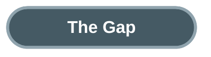
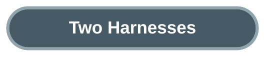
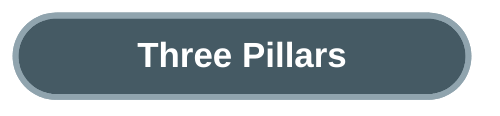
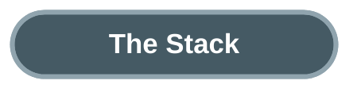
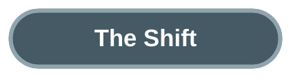

# The Operating System Your AI Agent Is Missing

An agent completes 49 steps perfectly. Step 50, it rewrites the database schema. No crash, no error — just drift. The model scored 95% on every benchmark. What failed was everything around it: the guardrails, the context management, the runtime. Phil Schmid put a name on this gap in January 2026: the Agent Harness.

The best agents on Terminal-Bench Hard — complex, multi-step terminal tasks — complete 53-58% of challenges [7]. Not because the models lack intelligence. GPT-5.4 and Claude Opus 4.6 score near-identically when wrapped in the same agent framework, ForgeCode, both hitting 81.8% on the standard benchmark [7]. The harness matters as much as the model. Swap the harness, keep the model, and scores swing dramatically [13].

The gap between model intelligence and agent reliability is the central tension of 2026. Static benchmarks measure what a model knows. They cannot measure what happens at step 50, when context has decayed, when the agent has drifted from its original plan, when accumulated small errors compound into a schema rewrite.

Phil Schmid named the infrastructure that manages this gap. An Agent Harness is "the infrastructure that wraps around an AI model to manage long-running tasks. It is not the agent itself. It is the software system that governs how the agent operates, ensuring it remains reliable, efficient, and steerable" [1]. The analogy is direct: the model is the CPU, providing raw processing power. The context window is RAM — limited, volatile working memory. The agent harness is the operating system — managing the boot sequence, providing standard drivers, curating what the application can see and do. The agent itself is just the application running on top.

![Hand-drawn pencil sketch showing an AI system architecture as a computer motherboard metaphor with four layers. At the bottom: a CPU chip labeled MODEL (CPU) and RAM stick labeled CONTEXT WINDOW (RAM). In the middle: a wide platform labeled AGENT HARNESS (OS) containing six cards for Prompt Presets, Tool Handling, Lifecycle Hooks, Planning, Filesystem Access, and Sub-Agent Management. On top: a browser window with a robot character labeled AGENT (Application). Arrows connect the layers. Inspired by Phil Schmid's original diagram.](images/os-analogy-sketch.jpg)

The harness provides six capabilities: prompt presets, opinionated tool call handling, lifecycle hooks, planning, filesystem access, and sub-agent management [1]. Manus refactored their harness five times in six months. LangChain re-architected their Open Deep Research agent three times in one year. Vercel removed 80% of their agents' tools — and performance improved [1]. The harness is not a one-time setup. It is the most iterated layer in the stack.

---

The same OS concept appears in radically different environments. Claude Code is a developer harness — an on-demand CLI that manages coding sessions. OpenClaw is a life harness — an always-on daemon that manages everything from WhatsApp messages to scheduled tasks. Both solve the same problem: making an AI model reliable across long-running, multi-step work.

Claude Code loads a four-level hierarchy of CLAUDE.md files — enterprise policies, project instructions, user preferences, and modular rules — as the agent's "boot sequence" [8]. Twenty-two lifecycle hook events (PreToolUse, PostToolUse, SessionStart, Stop, and eighteen more) let external systems intercept, validate, or block any action before it executes [8]. A deny-first permission system evaluates every tool call against tiered rules. Plan mode restricts the agent to read-only research before execution. Sub-agents (Explore, Plan, general-purpose) handle parallel tasks without nesting. The architecture is ephemeral — sessions start fresh, state persists only through files and git.

OpenClaw runs a persistent Gateway daemon on a WebSocket port, always listening across 20+ channel adapters: WhatsApp, Telegram, Discord, Slack, Signal, iMessage, and more [9]. SOUL.md defines the agent's personality and boundaries. AGENTS.md provides the boot sequence. Docker sandboxing isolates each session with configurable scope (per-agent, per-session, or shared). Three security layers — Identity (who can talk), Scope (what tools are available), Model (reducing blast radius from prompt injection) — manage safety [9]. Sub-agents can spawn dynamically, communicate with each other, and run on cron schedules. The architecture is persistent — the Gateway is the operating system, agents are long-lived processes.

One is episodic — opens like a text editor, closes when done. The other is continuous — runs like a system service, always available. The runtime model differs. The harness pattern does not.

OpenClaw reached 325K GitHub stars in under 60 days, surpassing React as the most-starred software project on GitHub [14]. Peter Steinberger, its creator, joined OpenAI in February 2026 to work on "next-generation personal agents." The velocity signals that harness engineering is not a niche concern — it is where practitioners are investing.

---

OpenAI shipped approximately one million lines of code with zero manually-written lines over five months, using Codex agents exclusively [3]. Three engineers grew to seven. Throughput averaged 3.5 pull requests per engineer per day — and increased as the team grew [3]. The experiment forced a question: when agents write all the code, what does the engineer actually do?

The answer: build the harness. Birgitta Boeckeler, analyzing the experiment for Martin Fowler's site, codified their approach into three pillars [4].

**Context Engineering.** "From the agent's point of view, anything it can't access in-context while running effectively doesn't exist" [3]. OpenAI treated AGENTS.md as "a table of contents, not a 1,000-page instruction manual." Plans were versioned artifacts checked into the repository. Dynamic context — Chrome DevTools integration, a local observability stack, per-worktree telemetry — gave agents access to runtime state, not just static documentation.

In Claude Code, this maps to the CLAUDE.md hierarchy plus auto-memory. In OpenClaw, it maps to SOUL.md plus a four-layer memory system (session, daily, long-term, shared) with self-reflection loops.

**Architectural Constraints.** OpenAI built a rigid layered architecture — Types → Config → Repo → Service → Runtime → UI — with forward-only dependencies enforced mechanically via custom linters and structural tests [3]. "By enforcing invariants, not micromanaging implementations, we let agents ship fast without undermining the foundation" [3]. Linter error messages doubled as remediation instructions: when an agent violated a constraint, the error told it how to fix the violation.

Chad Fowler named the principle: "probabilistic inside, deterministic at the edges" [6]. The model generates non-deterministically. The harness enforces deterministically. Rigor does not disappear when AI writes the code — it relocates from who writes the code to what the code must satisfy [6].

In Claude Code, this maps to deny-first permissions and lifecycle hooks that can block any tool call. In OpenClaw, it maps to Docker sandboxing and tool policy profiles.

**Garbage Collection.** OpenAI's team initially spent every Friday — 20% of the week — manually cleaning up "AI slop" [3]. That did not scale. They automated it: background Codex tasks now scan for deviations, update quality grades, and open targeted refactoring pull requests. "Technical debt is like a high-interest loan: it's almost always better to pay it down continuously in small increments" [3].

In Claude Code, this maps to context compaction (auto-triggered at ~95% window capacity) and checkpoint commits. In OpenClaw, it maps to memory flush cycles and session pruning.

Boeckeler's assessment: "What they describe sounds like much more work than just generating and maintaining a bunch of Markdown rules files. They built extensive tooling for the deterministic part of the harness" [4]. Harness engineering is not prompt engineering with a new name. It requires building actual infrastructure — linters, structural tests, automated scanning agents, observability pipelines.

---

The infrastructure is not theoretical. Over 1.5 billion dollars in funding and acquisitions flowed into agent harness components in 2025-2026 [17]. CB Insights mapped 400+ startups across 16 categories [17]. Every layer of the harness now has dedicated vendors.

**Sandboxes.** E2B (32M raised, Firecracker microVMs with sub-200ms cold starts) and Daytona (31M raised, 90ms Docker-based sandboxes) provide isolated execution environments where agents run untrusted code safely [18].

**Observability.** Braintrust raised 121M at an 800M valuation in February 2026 for agent-specific tracing and evaluation [19]. Langfuse, the open-source alternative with 20K GitHub stars, was acquired by ClickHouse in January 2026 [20].

**Orchestration.** CrewAI (18M raised, 45.9K stars) and LangGraph (24.8K stars, 34.5M monthly downloads) provide multi-agent coordination [21].

**Memory.** Mem0 (24M raised) and Zep build dedicated agent memory systems that go beyond vector databases, handling session, daily, and long-term recall [22].

**Security.** Cybersecurity incumbents acquired over 930M in agent security startups in 2025 alone: Palo Alto Networks bought Protect AI, SentinelOne bought Prompt Security, F5 bought CalypsoAI [23].

All four major cloud platforms launched agent management services. Azure AI Foundry covers five of Schmid's six harness components. Google Vertex AI covers four. AWS Bedrock AgentCore takes a modular approach — Memory, Identity, and Policy as independent managed services that any framework can consume. Nvidia shipped NemoClaw (enterprise OpenClaw) and OpenShell (security runtime) at GTC 2026 with 17 enterprise adopters [24].

The consolidation is already faster than the formation. Langfuse acquired. Helicone acquired. Microsoft merging AutoGen and Semantic Kernel into a single framework. Traditional observability platforms (Datadog, New Relic) expanding into agent monitoring. The pattern looks less like a new standalone industry and more like how DevSecOps emerged — genuinely new concerns grafted onto existing infrastructure categories, with incumbents absorbing startups as features.

---

The evolution follows a clear trajectory. In 2022-2023, the question was "what should I say to the AI?" — prompt engineering, optimizing the words in a single request. Andrej Karpathy captured the era: "The hottest new programming language is English."

In mid-2025, the question shifted to "what should the AI know?" Tobi Lutke, Shopify's CEO, named it on June 18, 2025: "I really like the term 'context engineering' over prompt engineering. It describes the core skill better: the art of providing all the context for the task to be plausibly solvable by the LLM" [16]. Anthropic formalized the practice three months later [15].

In early 2026, the question became "what environment should the AI operate in?" Phil Schmid named the agent harness on January 5, 2026 [1]. Mitchell Hashimoto coined "harness engineering" on February 5: "anytime you find an agent makes a mistake, you take the time to engineer a solution such that the agent never makes that mistake again" [2]. OpenAI validated the discipline at scale eight days later [3].

Each stage subsumes the previous one. Context engineering includes prompt engineering. Harness engineering includes context engineering. The shift is from model-centric to system-centric thinking.

But a warning applies. Rich Sutton's Bitter Lesson observes that general methods leveraging computation beat human-knowledge-based methods every time [5]. Harnesses encode human knowledge about agent behavior — retry logic, checkpointing, review loops. Some of these components will be absorbed into more capable models. Thibault Sottiaux of OpenAI's Codex team argues bluntly: "If you rely on complex scaffolding to build AI agents you aren't scaling, you are coping" [10].

The honest assessment: harness engineering is approximately 70% repackaged existing practice — distributed systems, security engineering, DevOps — and 30% genuinely new. What is new: context window management across sessions, prompt engineering as infrastructure, non-deterministic output handling as a first-class concern, and the compound reliability math where even 99% per-step accuracy degrades across long chains.

Build harnesses that are lightweight, modular, and built to delete. Every new model generation will obsolete some of today's orchestration patterns. The components that survive will be the ones that look less like clever workarounds and more like genuine infrastructure — the difference between a scaffolding and a foundation.

**If you're building agents**, the harness is your product, not the model. Invest in lifecycle hooks, context management, and deterministic boundaries.

**If you're using agents**, the quality of the harness determines the quality of the output. Choose tools with strong harness engineering — permissions, planning, context hierarchy.

**If you're evaluating agents**, look past benchmark scores. Ask: how does it handle step 50? What happens when context decays? Can it recover from drift?

---

The pattern is not specific to coding agents or life assistants. Any system that runs an AI model through a multi-step workflow needs a runtime — context management, safety boundaries, tool orchestration, entropy repair. The discipline that separates demo agents from production agents is not building smarter models — it is building better operating systems for the models we already have.

---

**References**

1. Phil Schmid. "The Importance of Agent Harness in 2026." [philschmid.de](https://www.philschmid.de/agent-harness-2026).
2. Mitchell Hashimoto. "My AI Adoption Journey." [mitchellh.com](https://mitchellh.com/writing/my-ai-adoption-journey).
3. Ryan Lopopolo / OpenAI. "Harness Engineering." [openai.com](https://openai.com/index/harness-engineering/).
4. Birgitta Boeckeler. "Harness Engineering." [martinfowler.com](https://martinfowler.com/articles/exploring-gen-ai/harness-engineering.html).
5. Rich Sutton. "The Bitter Lesson." [incompleteideas.net](http://www.incompleteideas.net/IncIdeas/BitterLesson.html).
6. Chad Fowler. "Relocating Rigor." [aicoding.leaflet.pub](https://aicoding.leaflet.pub/3mbrvhyye4k2e).
7. Terminal-Bench 2.0. [tbench.ai](https://www.tbench.ai/).
8. Anthropic. "Claude Code Documentation." [code.claude.com](https://code.claude.com/docs/en/hooks-guide).
9. OpenClaw. GitHub Repository. [github.com/openclaw/openclaw](https://github.com/openclaw/openclaw).
10. Thibault Sottiaux / OpenAI Codex. "Agentic Autonomy." [linearb.io](https://linearb.io/blog/openai-codex-thibault-sottiaux-agentic-autonomy).
11. Daniel Miessler. "Bitter Lesson Engineering." [danielmiessler.com](https://danielmiessler.com/blog/bitter-lesson-engineering).
12. Anthropic. "Effective Harnesses for Long-Running Agents." [anthropic.com](https://www.anthropic.com/engineering/effective-harnesses-for-long-running-agents).
13. Nate B Jones. "Same Model, 78% vs 42%." [natesnewsletter.substack.com](https://natesnewsletter.substack.com/p/same-model-78-vs-42-the-harness-made).
14. Star History. "OpenClaw Surpasses React." [star-history.com](https://www.star-history.com/blog/openclaw-surpasses-react-most-starred-software).
15. Anthropic. "Effective Context Engineering for AI Agents." [anthropic.com](https://www.anthropic.com/engineering/effective-context-engineering-for-ai-agents).
16. Tobi Lutke. Tweet coining "context engineering." (Jun 18, 2025) [x.com/tobi](https://x.com/tobi/status/1935533422589399127).
17. CB Insights. "AI Agent Market Map." [cbinsights.com](https://cbinsights.com/research/ai-agent-market-map-2025/).
18. E2B Series A / Daytona Series A. [prnewswire.com](https://www.prnewswire.com/news-releases/e2b-raises-a-21m-series-a-to-offer-cloud-for-ai-agents-to-fortune-100-302514540.html).
19. Braintrust Series B. [axios.com](https://www.axios.com/pro/enterprise-software-deals/2026/02/17/ai-observability-braintrust-80-million-800-million).
20. ClickHouse acquires Langfuse. [clickhouse.com](https://clickhouse.com/blog/clickhouse-acquires-langfuse-open-source-llm-observability).
21. CrewAI / LangGraph adoption data. [insightpartners.com](https://www.insightpartners.com/ideas/crewai-scaleup-ai-story/).
22. Mem0 Series A. YC / Peak XV backed (Oct 2025).
23. Protect AI / Prompt Security / CalypsoAI acquisitions. Multiple sources (2025).
24. Nvidia GTC 2026 agent platform. [venturebeat.com](https://venturebeat.com/technology/nvidia-launches-enterprise-ai-agent-platform-with-adobe-salesforce-sap-among).
