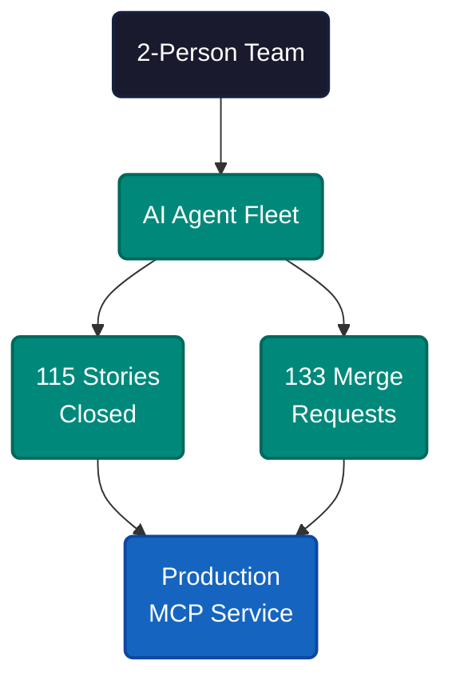
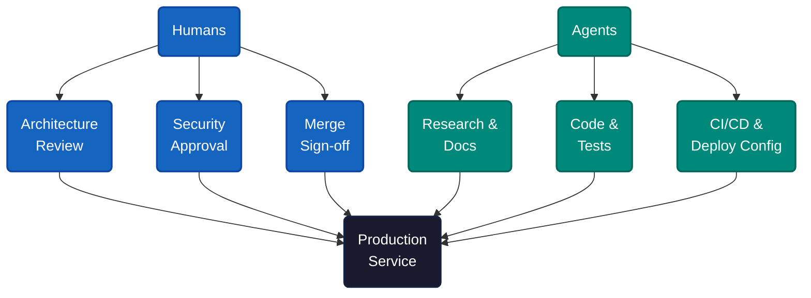
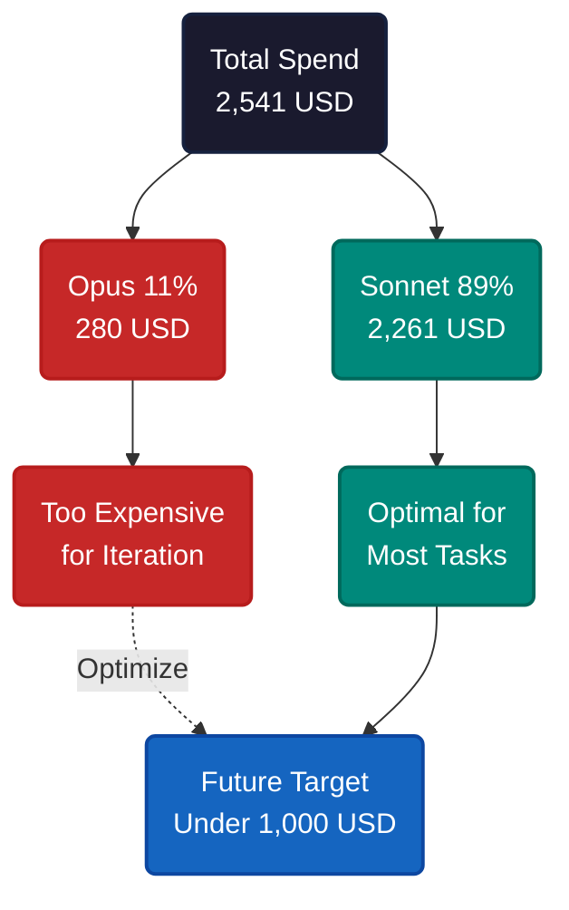

# Two Builders, 115 Stories, and an AI Team

Two software builders. Sixty-one calendar days. The deliverable: a production MCP service with OAuth 2.1 authentication for TradeStation's trading platform — 115 Jira stories closed, 133 merge requests merged.

This was not assisted coding. It was a full operating model where AI agents performed sustained work across every delivery phase while humans held accountability for every decision.

The core team closed 115 out of 130 stories — 88.5% completion for the beta production release. Merge velocity averaged 2.18 requests per calendar day across five two-week sprints. Sprint velocity hit roughly 23 stories per cycle — a pace that would strain a team twice the size under traditional delivery. No external contractors. No borrowed headcount. Two people and a fleet of specialized AI agents covering planning, research, architecture, implementation, debugging, and DevOps.

Agents participated in every phase: requirements analysis, Jira story creation, architecture documents, code implementation, test generation, CI/CD configuration, and handoff documentation. Humans reviewed architecture, enforced security standards, and signed off on every merge. Agents handled volume. Humans handled judgment.

---

Agentic SWE means AI agents do sustained, multi-step work — not one-shot code suggestions — across planning, design, implementation, and documentation. Humans act as supervisors, approvers, and escalation paths. The team redesigned the delivery workflow around this split instead of bolting an agent onto the existing process.

All project context lived in GitLab — architecture docs, API contracts, auth models, nonfunctional requirements. Agents read and wrote shared context there rather than creating side-channel documents. Every commit and merge request had a named human owner. Four hard rules governed the process: no merge without human review, no ticket closure without PM sign-off, no auth change without security approval, no deployment unless the runbook was updated.

The phrase that captured it: "The agent proposes; a human disposes."

---

Assume each agent step succeeds 99% of the time. After 10 steps, cumulative success drops to 90.4%. After 50: 60.5%. After 100: 36.6%. After 500: less than 1%.

The math is 0.99 raised to the power of steps taken. Errors compound because each wrong assumption propagates downstream. Context pollution accelerates the decay — failed attempts remain in conversation history, degrading future decisions.

The fix is human checkpoints at critical milestones — design review before implementation, security review before deployment, architecture approval before structural changes. Each checkpoint resets the error chain by catching drift before it compounds. Nearly half the 61-day timeline was consumed by these human review cycles — cross-department security approvals, architecture sign-offs, stakeholder alignment. The agents could have moved faster. The guardrails were the bottleneck, and that was the right tradeoff.

The team anchored this with a specification-centric workflow. Agents referenced central documents — requirements, architecture decisions, API contracts — not conversation history. Short-term agent context stayed focused and disposable. Long-term memory lived in the spec. Agent conversations could be reset without losing project continuity.

---

Total inference cost: 2,541 USD on AWS Bedrock Claude models. Per story: 22.10 USD. Per merge request: 19.10 USD.

The higher figure reflects methodology experimentation — different models, agent configurations, and workflow patterns tested across 61 days. Claude Opus (280 USD, 11% of total spend) proved too expensive for iteration cycles without justifying its quality premium over Sonnet for most tasks. The estimated optimized cost for future projects: under 1,000 USD total, a 60% reduction, or roughly 9 USD per story. Default to Sonnet, reserve expensive models for genuinely complex reasoning, and reuse proven workflow patterns. At 9 USD per story, the marginal cost of a well-specified feature is negligible.

---

The TradeStation MCP service built through this process went on to win industry recognition — evaluated across 300+ variables among 14 U.S. online brokerages:

- 🏆 **#1 Innovation Award** — StockBrokers.com 2026 Annual Industry Awards
- 🥇 **Best in Class** — Active Traders
- 🥇 **Best in Class** — Advanced Trading
- 🥇 **Best in Class** — Options Trading
- 🥇 **Best in Class** — Futures Trading

---

Agents handle volume and velocity. Humans handle judgment and accountability. The math works when guardrails reset error accumulation and specifications anchor long-term context. Agentic SWE does not replace engineers — it restructures how engineering capacity is deployed.

---

**References**

1. McKinsey & Company. "The Agentic Organization: Contours of the Next Paradigm." [mckinsey.com](https://www.mckinsey.com/capabilities/mckinsey-digital/our-insights/the-agentic-organization).
2. arXiv. "Impact of Generative AI on Software Engineering Productivity." [arxiv.org](https://arxiv.org).
3. Anthropic. "Model Context Protocol Specification." [modelcontextprotocol.io](https://modelcontextprotocol.io).
4. StockBrokers.com. "TradeStation Securities Wins #1 Innovation Award — 2026 Annual Industry Awards." [tradestation.com](https://www.tradestation.com/press-and-news/tradestation-securities-wins-number-1-innovation-award-in-stockbrokerscom-2026-annual-industry-awards/).
