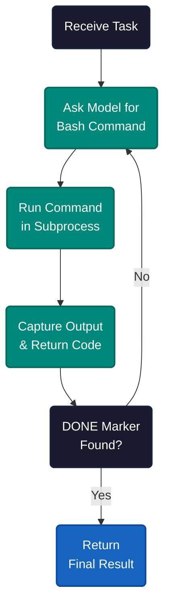
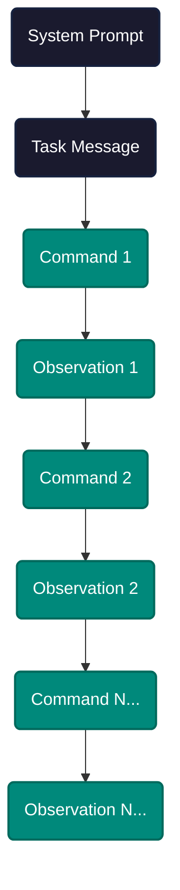
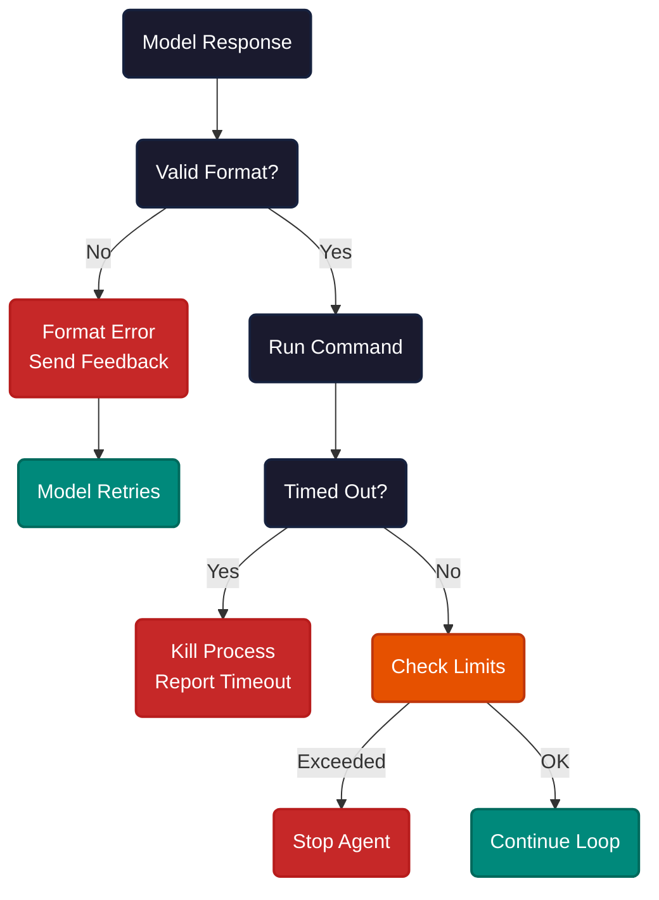
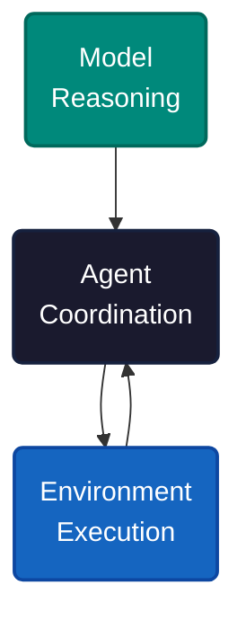

# One Tool, One Loop, One Done Marker

Strip an AI coding agent to its minimum. One tool: bash. One control flow: loop until done. One completion signal: a marker string in the output. No function-calling framework, no tool registry, no planner module.

This is mini-swe-agent — roughly 200 lines of Python that solves real coding tasks by doing the simplest thing that could possibly work.

The agent receives a task. It asks the model for one bash command. It runs that command in a subprocess. It reads the output. It asks for the next command. This repeats until the model outputs a DONE marker — a specific string like `COMPLETE_TASK_AND_SUBMIT_FINAL_OUTPUT` — as the first line of its response.

That is the entire architecture. No routing logic, no chain-of-thought orchestration, no multi-agent coordination. The model sees the full conversation history each iteration and decides what to do next based on everything that has happened so far.

---

Every iteration sends the complete conversation to the model. The messages array starts with a system prompt and the task description, then grows by two messages per cycle: the model's bash command (assistant role) and the execution output (user role, labeled as an observation).

By step 10, the model sees the system prompt, the task, and 20 additional messages — 10 commands and 10 observations. The context grows linearly. The model processes everything from scratch each time, which is simple but expensive: a 50-step task sends the full history 50 times.

The system prompt is a Jinja2 template that renders with runtime variables — task description, step limit, cost limit, and working directory. The observation template wraps each command output with the return code, so the model knows whether a command succeeded or failed without parsing stderr.

---

Three things break the loop. Format errors: the model returns something other than a single bash code block — the agent sends an error message back and lets the model retry. Timeouts: a command runs longer than the configured limit — the agent kills the process and reports what happened. Limit violations: step count or inference cost exceeds the ceiling — the agent stops and returns whatever it has.

Format errors are recoverable — the model gets feedback and adjusts. Timeouts are informational — the model sees what happened and can try a different approach. Limit violations are terminal. The DONE marker is the only clean exit. If the model never outputs it, the loop runs until a limit stops it.

---

Three components carry all the weight. The model decides what to do — it is the reasoning engine. The environment executes bash commands — it is the hands. The agent manages the loop, validates format, enforces limits, and assembles messages — it is the coordinator.

This decomposition is the same one used by every agent framework, just without the abstraction layers. Claude Code uses dozens of tools and sophisticated routing, but underneath it follows the same pattern: model generates action, environment executes, agent coordinates. The simplicity of mini-swe-agent makes this visible.

One tool works because bash is universal. File reads, writes, searches, compilations, test runs, git operations — all reachable through a single interface. The model does not need a curated tool menu. It needs a shell.

---

The pattern behind every AI coding agent is the same loop: observe, decide, act, observe again. Complexity comes from adding tools, routing, and parallelism — but the core loop does not change. Understanding the minimum viable agent makes the sophisticated ones legible, not mysterious — it strips away scaffolding to reveal the mechanism underneath.

---

**References**

1. SWE-agent. "Mini SWE Agent." [github.com/SWE-agent/mini-swe-agent](https://github.com/SWE-agent/mini-swe-agent).
2. Jimenez, Carlos et al. "SWE-bench: Can Language Models Resolve Real-World GitHub Issues?" [arxiv.org](https://arxiv.org/abs/2310.06770).
