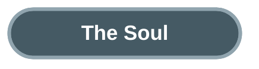

# Build Your Own OpenClaw with Claude Code

You message your agent from Telegram: "Research the top headless CMS options for our blog, then set up the best one." Twelve minutes later, your phone buzzes with the reply. Sanity installed, schemas configured, API routes created. You never opened a terminal.

This is not a future product pitch. Every piece of this exists today, inside a tool most developers already have installed: Claude Code.


OpenClaw showed the world what an always-on personal AI agent looks like: a persistent daemon listening on WhatsApp, Telegram, and Slack, managing your tasks, learning your preferences, building its own tools. Over 250,000 GitHub stars. A genuine shift in how people think about AI assistants.

But building something like OpenClaw from scratch is a serious engineering project. You need a message gateway, a session manager, a security layer, a memory system, a tool runtime, and a model router. Most of that infrastructure already exists — scattered across Claude Code's features, waiting to be composed.

Claude Code Channels (March 2026) is the missing piece. It turns Claude Code into a programmable daemon gateway that receives messages from Telegram, Discord, iMessage, and arbitrary webhooks. Combine it with the hooks system, native sandboxing, agent teams, scheduled tasks, and the flat-rate economics of Claude MAX, and you have a complete toolkit for building an autonomous agent product without writing gateway code.

The core idea: instead of building from scratch, compose existing primitives. Claude Code is the proven agent runtime. Channels is the messenger bridge. Hooks are the operating system. Memory is the soul. Skills are the capabilities. MAX is the economics.


---


A Channel is an MCP server that Claude Code spawns as a subprocess. It declares a special capability (`claude/channel`) and pushes events into the running session. Claude reads the event, does the work, and replies through the same channel.

The message flow is straightforward: your Telegram bot receives a message via the Bot API. The Channel plugin wraps it as a notification and sends it to Claude Code over stdio. Claude processes the request with full local environment access — your files, your git repos, your terminal, your MCP tools. Then it calls the channel's reply tool, and the response shows up on your phone.

Three platforms ship in the research preview: Telegram (polling-based), Discord (WebSocket), and iMessage (reads the Messages database directly on macOS). A localhost demo called fakechat lets you test the flow without any external service.

The real power is custom channels. Any system that can send an HTTP POST can push events to Claude. CI pipelines, monitoring alerts, webhook integrations — anything. A custom webhook channel is about 30 lines of TypeScript:

```typescript
const mcp = new Server(
  { name: 'webhook', version: '0.0.1' },
  {
    capabilities: { experimental: { 'claude/channel': {} } },
    instructions: 'Events arrive as <channel source="webhook">. Act on them.',
  },
)

await mcp.connect(new StdioServerTransport())

Bun.serve({
  port: 8788,
  hostname: '127.0.0.1',
  async fetch(req) {
    const body = await req.text()
    await mcp.notification({
      method: 'notifications/claude/channel',
      params: { content: body, meta: { path: new URL(req.url).pathname } },
    })
    return new Response('ok')
  },
})
```

Two-way channels expose reply tools so Claude can send messages back. Permission relay lets you approve tool use from your phone — Claude forwards the prompt with a 5-letter request ID, you reply "yes abcde" from Telegram, and the tool executes. First answer wins, whether you respond from the terminal or your phone.

Every channel maintains a sender allowlist. Only paired users can push messages. Everyone else is silently dropped. This is the first line of defense against prompt injection from external platforms.

---


Claude Code with `--channels` stays alive and listens. The session process itself is the daemon. When a message arrives, Claude processes it, responds, and returns to listening. No external orchestration needed.

```bash
cd my-autonomous-agent/
claude --channels plugin:telegram@claude-plugins-official
```

That command starts your agent. It stays running as long as the terminal is open. Sessions auto-save to `~/.claude/projects/` with complete message history. If you need to restart, `claude --resume <session-id>` picks up where you left off — memory, context, and channel connections restored.

For remote operation on a VPS, wrap it in tmux so the session survives SSH disconnects. For local development, just keep the terminal open. The session is your daemon.

Context window compaction happens in-place. When the conversation history grows too large, Claude summarizes older turns while preserving essential context. The session continues without restart. With the 1M token context window on Opus, compaction is infrequent for most workloads.

Each session is independent. You can run multiple sessions in parallel — each with its own 1M context window, its own channel configuration, its own memory. But for a single-user autonomous agent, one session is all you need. The routing happens inside the session, not between sessions.

---


You do not pre-configure agent teams. You send a task, and Claude Code dynamically decides what team it needs.

A simple question gets answered directly. No agents spawned, no overhead. But a complex request — "research the best auth library for our Next.js app, then implement it" — triggers team formation. Claude creates a team, spawns a researcher and an implementer, assigns tasks with dependencies, coordinates their work, synthesizes the results, and replies through the channel.


The key insight: Claude Code is the orchestrator. You define specialist subagents in `.claude/agents/`, and Claude decides when and how to use them based on what you ask.

```yaml
# .claude/agents/research-agent.md
---
name: research-agent
description: Research topics using web search and documentation
memory: project
model: sonnet
tools: Read, Grep, Glob, Bash
---
You are a research specialist. Search official docs, community
resources, and academic sources. Return findings with source URLs.
```

Each subagent gets its own context window, memory scope, and tool restrictions. The main session acts as team lead — receiving channel messages, classifying task complexity, and delegating accordingly.

| Task Complexity | What Happens |
|----------------|-------------|
| Quick question | Claude answers directly |
| Single-domain task | One specialist subagent spawned |
| Multi-step task | Team created with shared task list |
| Cross-domain task | Multiple specialists, sequential or parallel |

Teams dissolve when the task is done. On MAX flat-rate pricing, the extra token consumption from running 3-4 agents in parallel costs nothing at the margin. You can be generous with team formation because the compute is already paid for.

For coding tasks, agents can work in isolated git worktrees — each gets a temporary copy of the repo, works independently, and returns changes via standard git merge. No conflicts during parallel work.

One important detail for self-improvement: worktrees fragment memory. Each worktree gets its own `~/.claude/projects/` directory. Skills and CLAUDE.md changes (in the git repo) merge back via git. But auto-memory (stored in your home directory) stays separate per worktree. Run self-reflection in the main session to keep memory unified.

---


An autonomous agent that accepts messages from the internet needs a security harness. Claude Code provides one through hooks and sandboxing — 22+ lifecycle events that let you intercept, validate, and control every action the agent takes.


Hooks fire at specific points in Claude's lifecycle. Four types: command hooks run shell scripts, HTTP hooks call endpoints, prompt hooks use an LLM for judgment calls, and agent hooks spawn subagents for complex verification. The most important ones for an autonomous agent:

**SessionStart** initializes the agent's context. It fires on startup and resume. Use it to inject the agent's identity, load environment variables, and set up the working context.

**UserPromptSubmit** fires before Claude processes any input — including channel messages. This is where you validate and filter incoming messages for prompt injection attempts. Block suspicious patterns, tag messages as untrusted external input, or inject additional context.

**PreToolUse** is the primary security gate. It fires before every tool execution and can approve, deny, or modify the action. Block destructive bash commands, restrict file access to the project directory, require confirmation for sensitive operations. This is the enforcement layer that makes autonomous operation safe.

**PostToolUse** fires after successful tool execution. Use it for audit logging — append every tool call to a log file so you can review what the agent did.

The sandbox adds OS-level enforcement on top of hooks. On macOS, Seatbelt restricts filesystem and network access for all bash subprocesses. Write access defaults to the current working directory. Network access goes through a proxy with a domain allowlist. Even if prompt injection bypasses the hooks, the sandbox limits what the compromised agent can actually do.

```json
{
  "sandbox": {
    "enabled": true,
    "filesystem": {
      "allowWrite": ["./data", "./output"],
      "denyRead": ["~/.ssh", "~/.aws", "~/.gnupg"]
    },
    "excludedCommands": ["docker", "docker-compose"]
  }
}
```

One critical detail: permission deny rules only cover Claude's built-in tools (Read, Edit, Write). Bash commands can bypass file-level restrictions. The sandbox is the only layer that catches bash. Use both together — sandbox for bash, deny rules for built-in tools.

The defense-in-depth stack: sender allowlist at the channel level, input validation via UserPromptSubmit hooks, tool control via PreToolUse hooks, OS-level sandboxing for bash, permission modes for safe defaults, audit logging via PostToolUse hooks, and permission relay for human approval of critical operations. Seven layers. Each one independent. An attacker has to breach all of them.

---



An autonomous agent needs identity. Not just instructions for a single task, but a layered personality that persists across sessions, accumulates experience, and evolves over time.

Claude Code's identity system has five layers, loaded in order at every session start.


**CLAUDE.md** is the foundation. Core personality, behavioral rules, ethical boundaries, routing instructions. Target under 200 lines — longer files reduce adherence. This is your agent's constitution. It loads at every session start, every resume, every compaction recovery. Three scopes layer: managed policy (organization-wide), project-level, and user-level.

**Rules** in `.claude/rules/` add conditional behavior. Path-scoped rules load only when working with matching files. Your agent can behave differently when handling API code versus processing channel messages versus writing documentation — without bloating every conversation with every rule.

**Auto memory** is the agent's learned experience. Stored in `~/.claude/projects/<project>/memory/`, it captures corrections, preferences, and patterns across sessions. Four types: user (who you are), feedback (what to avoid or repeat), project (ongoing context), and reference (where to find things). The first 200 lines of MEMORY.md load at every session. Topic files load on demand.

Auto memory is conservative. One power user found exactly 12 lines after months of daily use. It captures the "what" — a specific fix, a naming convention — but not the "why." For critical behavioral rules, write them in CLAUDE.md explicitly. Do not rely on auto memory for anything important.

**Skills** extend what the agent can do. SKILL.md files in `.claude/skills/` define specialized capabilities that load on demand. Your agent does not need every skill in every conversation — descriptions are loaded for discovery, and full content is injected only when relevant.

**Subagents** are the agent's extended self. Custom agents in `.claude/agents/` with their own memory scopes, tool restrictions, and personalities. They enable domain specialization without the overhead of loading every domain's context into every conversation.

For a single-user agent, routing happens via CLAUDE.md instructions:

```markdown
When you receive a channel message, classify and route:
- Code/programming → delegate to code-agent
- Research/questions → delegate to research-agent
- Email/messages → delegate to email-agent
- Schedule/reminders → handle directly
```

Claude reads this at session start and applies it to every incoming channel message. The routing is natural language — no router service, no message bus, no configuration files. Just instructions that the agent follows.

---


Claude Code has no autonomous gap detection. It will not spontaneously decide it needs a new skill. All self-improvement must be explicitly scheduled.

This sounds like a limitation, and it is one compared to OpenClaw's Foundry system. But the "Agents of Chaos" paper (Shapira et al., 2026) found that autonomous self-improvement "barely worked" in practice — agents "readily default to requesting detailed instructions from their human operators." Scheduled, deliberate improvement turns out to be more reliable than spontaneous improvement.


Self-improvement happens across sessions. Each task session produces artifacts — new skills, memory updates, pattern logs. These merge back to the main session through git commits and memory writes. The nightly self-reflection session consolidates everything, creating new skills and updating CLAUDE.md. Future sessions start with all accumulated improvements loaded.

![Hand-drawn pencil sketch of a git-branch-style diagram. A thick vertical line labeled MAIN SESSION has horizontal branches extending right. The top branch SESSION: CMS TASK shows a robot working, with a dotted arrow merging back a NEW SKILL document. The middle branch SESSION: AUTH TASK merges back a MEMORY UPDATE. The third branch SESSION: SELF-REFLECT shows a robot at a mirror, merging back both a skill and CLAUDE.MD labeled EVOLVE. At the bottom, FUTURE SESSION shows a robot surrounded by all accumulated skills and memories, visibly more capable.](images/session-merge-loop-sketch.jpg)

The self-improvement pipeline has four phases.

**Capture** runs during every session. Auto memory saves corrections. A CLAUDE.md instruction tells the agent to log recurring patterns to a `.learnings/` directory. PostToolUse hooks log tool failures. Every interaction leaves a trace.

**Schedule** triggers periodic reflection. Desktop scheduled tasks (macOS/Windows) survive restarts and fire fresh sessions. `/loop` works within the current session for shorter intervals. Cloud scheduled tasks run on Anthropic's servers for fully serverless automation.

```
Schedule: Daily at 11 PM
Prompt: "Run the self-reflect skill. Review .learnings/PATTERNS.md,
         identify recurring patterns, create skills for patterns
         that appeared 3+ times, consolidate memory."
```

**Evolve** creates new capabilities. When the self-reflection skill identifies a pattern that recurred three or more times, it creates a new SKILL.md file. When CLAUDE.md needs updating, it edits the file and commits the change. When memory needs pruning, it consolidates entries and keeps MEMORY.md under 200 lines.

**Validate** ensures quality. ConfigChange hooks validate auto-created skills and hooks. PreToolUse enforcement catches anything the new tools do wrong. The self-reflection skill reviews the last five sessions for regressions.

The compound improvement loop: each task teaches the agent something. Scheduled reflection promotes patterns to permanent capabilities. Future tasks benefit from accumulated knowledge. After a month of daily use, the agent handles your common workflows faster and with fewer mistakes — not because the model improved, but because the harness around it got smarter.

The **claude-reflect** plugin takes this further. It captures corrections in real time via regex patterns ("no, use X", "don't use Y", "remember:") with confidence scoring. `/reflect-skills` analyzes session history to discover repetitive workflows and auto-generate draft skill files. The capture is automatic. The review is human-gated. The improvement compounds.

---


An always-on agent consumes tokens continuously. Context reloads, message processing, tool calls, memory operations, self-reflection cycles. A moderate daemon uses roughly 7.5 million tokens per day — about 225 million per month.

On the Anthropic API, that costs roughly $400/month for Opus at current pricing. On Claude MAX 20x, it costs $200/month flat. Same compute, same model, half the price. And the savings compound as usage grows — at 500M tokens, the API costs $1,000 while MAX stays at $200.


| Usage Level | Monthly API Cost | MAX 20x | Savings |
|-------------|-----------------|---------|---------|
| Medium (200M tokens) | ~$400 | $200 | 50% |
| Heavy (500M tokens) | ~$1,000 | $200 | 80% |
| Power (1B+ tokens) | ~$2,000+ | $200 | 90%+ |

The breakeven is around 100 million tokens per month. Most daemon agents exceed this within the first week.

The majority of tokens in Claude Code sessions are cache reads, priced at one-tenth of regular input cost. This means the effective per-token cost is far lower than headline API pricing suggests. A documented extreme case: 2.4 billion tokens in a single month, API equivalent $5,623, actual cost $200.

Agent teams multiply this advantage. A 3-agent team uses 3-4x the tokens of sequential work. On API pricing, that is a 3-4x cost increase. On MAX flat-rate, it is zero marginal cost. You can spawn teams freely because the compute is already paid for.

Rate limits exist. MAX 20x provides roughly 900 messages per 5-hour window with weekly quotas. A moderate daemon processing 100 messages per day fits comfortably. Heavy continuous agentic use may hit friction. Overflow pricing at API rates provides a safety valve.

The unique position: Claude Code on MAX is the only flat-rate autonomous agent option with frontier model access. OpenClaw routes to cheaper models to save money (Gemini Flash for heartbeats, DeepSeek for sub-agents). A Channel-based agent runs Opus for everything because the subscription already covers it.

---


A walkthrough of one user task, from Telegram message to self-improvement, touching every layer.


**8:00 AM** — You send a Telegram message: "Research the top 3 headless CMS options for our Next.js blog, then set up the best one."

The Telegram Channel MCP server receives it, wraps it as a notification, and pushes it to the Claude Code session. The UserPromptSubmit hook validates the input. Claude reads CLAUDE.md, recognizes a multi-step cross-domain task, and creates a team.

**8:01 AM** — Claude spawns a research-agent and a code-agent. Task 1: "Research top 3 headless CMS." Task 2: "Implement winner" (blocked on Task 1). The research-agent searches the web, reads official docs, compares pricing and integration quality. Every tool call is logged by the PostToolUse hook.

**8:05 AM** — Research complete. Task 1 resolved. Task 2 unblocked. The code-agent reads the findings, runs the setup, configures environment variables, creates API routes, runs tests. PreToolUse hooks validate every bash command. The sandbox restricts writes to the project directory.

**8:12 AM** — Claude synthesizes the team's work and replies via Telegram: "Done. Went with Sanity — best Next.js integration, generous free tier. Studio configured, API routes created, schemas ready. Run npm run dev to see it."

Auto memory saves: "User's project uses Sanity CMS." The PostToolUse hook appends to `.learnings/PATTERNS.md`: "CMS setup task — research-then-implement pattern used." Team dissolves.

**12:00 PM** — A scheduled heartbeat fires. Claude checks for pending tasks, reviews recent messages, reports all clear.

**11:00 PM** — The daily self-reflection skill runs in the main session. It reads `.learnings/PATTERNS.md`, notices the "research-then-implement" pattern appeared three times this week. Creates a new skill at `.claude/skills/research-implement/SKILL.md`. Consolidates memory. Commits the new skill to git.

**Next morning** — You ask: "Research the best testing framework for our API, then set it up." Claude recognizes the pattern, loads the research-implement skill, forms the team faster, executes more efficiently. The agent got better overnight.

---


No existing GitHub template covers the channel-based autonomous agent use case. Existing starter kits provide commands, hooks, and skills, but none include channel configs, agent definitions, or self-improvement architecture. This is a genuine gap in the ecosystem.

![Hand-drawn pencil sketch of an isometric project architecture diagram. At the top, a CLAUDE.MD document labeled SOUL contains personality traits. Below left, a .CLAUDE/ folder contains SETTINGS.JSON with hooks, RULES/ for safety, SKILLS/ for abilities, and AGENTS/ for specialists. Center, .MCP.JSON labeled CHANNELS connects to Telegram and webhook icons. Right, a .LEARNINGS/ folder holds PATTERNS.MD, ERRORS.MD, and AUDIT.MD. Bottom, a SCRIPTS/ folder contains INIT-SOUL.SH, VALIDATE-INPUT.SH, and BLOCK-DESTRUCTIVE.SH. Arrows show data flow between all components.](images/blueprint-architecture-sketch.jpg)

Here is a template structure that packages everything discussed in this post:

```
my-autonomous-agent/
├── CLAUDE.md                    # Personality + routing rules (<200 lines)
├── .claude/
│   ├── settings.json            # Hooks, sandbox config, permissions
│   ├── rules/
│   │   ├── safety.md            # Always-loaded safety constraints
│   │   └── channel-messages.md  # Handle external messages as untrusted
│   ├── skills/
│   │   ├── self-reflect/SKILL.md
│   │   ├── memory-consolidate/SKILL.md
│   │   └── [your-domain]/SKILL.md
│   └── agents/
│       ├── code-agent.md
│       ├── research-agent.md
│       └── email-agent.md
├── .mcp.json                    # Channel server configs
├── channels/
│   └── webhook.ts               # Custom webhook channel (optional)
├── .learnings/                  # Self-improvement tracking
│   ├── ERRORS.md
│   ├── PATTERNS.md
│   └── AUDIT.md
└── scripts/
    ├── init-soul.sh             # SessionStart hook
    ├── validate-input.sh        # UserPromptSubmit hook
    ├── block-destructive.sh     # PreToolUse hook
    └── audit-log.sh             # PostToolUse hook
```

Each component has a specific role in the architecture:

**CLAUDE.md** is the entry point. Under 200 lines. It defines personality ("You are a productive, focused assistant"), routing rules ("classify incoming messages by domain and delegate to specialist agents"), and behavioral constraints ("never modify files outside the project directory"). This is the first thing loaded at every session start.

**settings.json** wires the hooks. Four hooks form the security harness: `init-soul.sh` fires on SessionStart to inject context and set environment variables. `validate-input.sh` fires on UserPromptSubmit to filter channel messages for injection patterns. `block-destructive.sh` fires on PreToolUse to deny dangerous bash commands like `rm -rf` or `curl | bash`. `audit-log.sh` fires asynchronously on PostToolUse to append every tool call to the audit log.

```json
{
  "hooks": {
    "SessionStart": [{ "matcher": "startup|resume",
      "hooks": [{ "type": "command", "command": "scripts/init-soul.sh" }] }],
    "UserPromptSubmit": [{ "hooks": [{ "type": "command",
      "command": "scripts/validate-input.sh" }] }],
    "PreToolUse": [{ "matcher": "Bash", "hooks": [{ "type": "command",
      "command": "scripts/block-destructive.sh" }] }],
    "PostToolUse": [{ "matcher": ".*", "hooks": [{ "type": "command",
      "command": "scripts/audit-log.sh", "async": true }] }]
  },
  "sandbox": { "enabled": true,
    "filesystem": { "denyRead": ["~/.ssh", "~/.aws", "~/.gnupg"] },
    "excludedCommands": ["docker"] }
}
```

**agents/** defines the specialist subagents. Each `.md` file specifies a name, description (used for auto-matching), memory scope, model, and allowed tools. The description is what Claude reads to decide which agent to spawn — make it specific. "Handle coding tasks — debugging, implementation, refactoring, test writing" gives Claude clear routing signals.

**.mcp.json** declares the channel server. For Telegram, the plugin handles everything. For custom webhooks, point it at your channel server script. Multiple channels can run simultaneously in the same session.

**.learnings/** is the self-improvement state. `PATTERNS.md` tracks recurring task patterns with tally marks. `ERRORS.md` logs tool failures from PostToolUse hooks. `AUDIT.md` is the full action history. The self-reflection skill reads these files, identifies patterns that appeared three or more times, and creates new skills for them.

**The startup sequence:**

1. Clone the template
2. Add your Telegram bot token, customize CLAUDE.md
3. Run `claude --channels plugin:telegram@claude-plugins-official`
4. Send a message from your phone

The agent initializes its soul via the SessionStart hook, loads CLAUDE.md and memory, connects to Telegram through the channel plugin, and starts listening. Scheduled tasks handle the heartbeat (every 4 hours) and self-reflection (nightly). The improvement loop runs in the background. Each day, the agent gets slightly better at your specific workflows.

---


This approach builds on a consumer subscription product. That comes with real constraints.

Channels are in research preview. The contract may change. Custom channels require a development flag. Rate limits can throttle heavy daemon usage. Anthropic has a documented pattern of tightening limits — weekly caps in August 2025, OAuth enforcement in January 2026, Agent SDK restrictions in February 2026.

The terms of service draw a clear line. Running Channels on MAX as a personal productivity daemon is explicitly supported. Extracting OAuth tokens for third-party products is explicitly prohibited. Building a commercial service on your MAX subscription is a gray zone — API keys under Commercial Terms are the only unambiguous path for serving customers.

Self-improvement requires explicit scheduling. The agent will not spontaneously create tools or update its own instructions. You have to set up the reflection skill, the scheduled tasks, and the pattern-tracking infrastructure. The compound improvement is real, but it takes deliberate engineering to enable.

These are real constraints. But they are also the constraints of building on proven, maintained infrastructure instead of maintaining your own gateway daemon, your own session manager, your own security layer, and your own model router. The tradeoff is platform dependency in exchange for not having to build any of it.

---

The pattern applies beyond Claude Code: the fastest way to build an autonomous agent product is not to build an agent from scratch. It is to find a proven agent runtime and compose its primitives into a product. Channels provide the messenger bridge. Hooks provide the operating system. Memory provides the soul. Skills provide the capabilities. Scheduled tasks provide the heartbeat. The subscription provides the economics. What OpenClaw built as a standalone product, you can assemble from parts that already exist — and the parts come with a team at Anthropic maintaining them.

---

**References**

1. Anthropic. "Push events into a running session with channels." [code.claude.com/docs/en/channels](https://code.claude.com/docs/en/channels).
2. Anthropic. "Channels reference." [code.claude.com/docs/en/channels-reference](https://code.claude.com/docs/en/channels-reference).
3. Anthropic. "Claude Code Hooks." [code.claude.com/docs/en/hooks](https://code.claude.com/docs/en/hooks).
4. Anthropic. "Sandboxing." [code.claude.com/docs/en/sandboxing](https://code.claude.com/docs/en/sandboxing).
5. Anthropic. "Making Claude Code more secure and autonomous." [anthropic.com/engineering/claude-code-sandboxing](https://www.anthropic.com/engineering/claude-code-sandboxing).
6. Anthropic. "Run prompts on a schedule." [code.claude.com/docs/en/scheduled-tasks](https://code.claude.com/docs/en/scheduled-tasks).
7. Anthropic. "Claude Code Memory." [code.claude.com/docs/en/memory](https://code.claude.com/docs/en/memory).
8. Shapira et al. "Agents of Chaos." 2026. Found autonomous behavior "barely worked" in deployed agents.
9. Peterson, Brent. "Automatic Memory Is Not Learning." Analysis of Claude Code auto-memory limitations.
10. Osmani, Addy. "Self-Improving Coding Agents." [addyosmani.com/blog/self-improving-agents](https://addyosmani.com/blog/self-improving-agents/).
11. BrightCoding. "claude-reflect: Self-Learning System." [blog.brightcoding.dev](https://www.blog.brightcoding.dev/2026/03/24/claude-reflect-transform-claude-code-into-a-self-learning-powerhouse).
12. Trail of Bits. "Claude Code Config." [github.com/trailofbits/claude-code-config](https://github.com/trailofbits/claude-code-config).
13. Dwarves Foundation. "Claude Guardrails." [github.com/dwarvesf/claude-guardrails](https://github.com/dwarvesf/claude-guardrails).
14. ClaudeClaw. "OpenClaw-style system on Claude Code." [github.com/moazbuilds/claudeclaw](https://github.com/moazbuilds/claudeclaw).
15. Anthropic. "Claude MAX Plan." [support.claude.com](https://support.claude.com/en/articles/11049741-what-is-the-max-plan).
