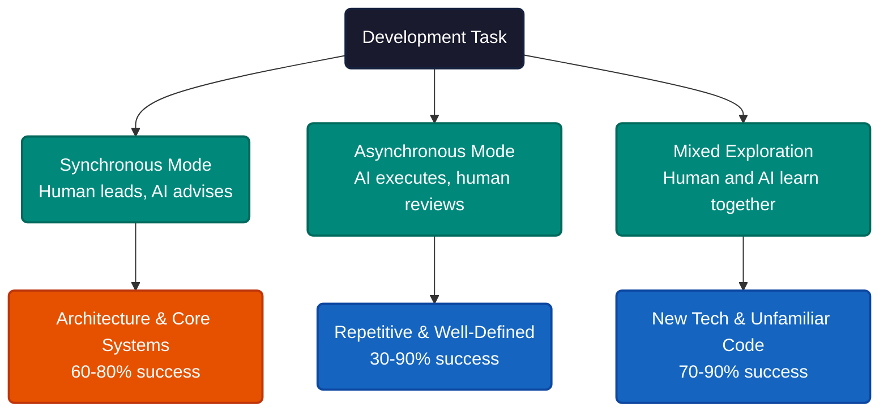
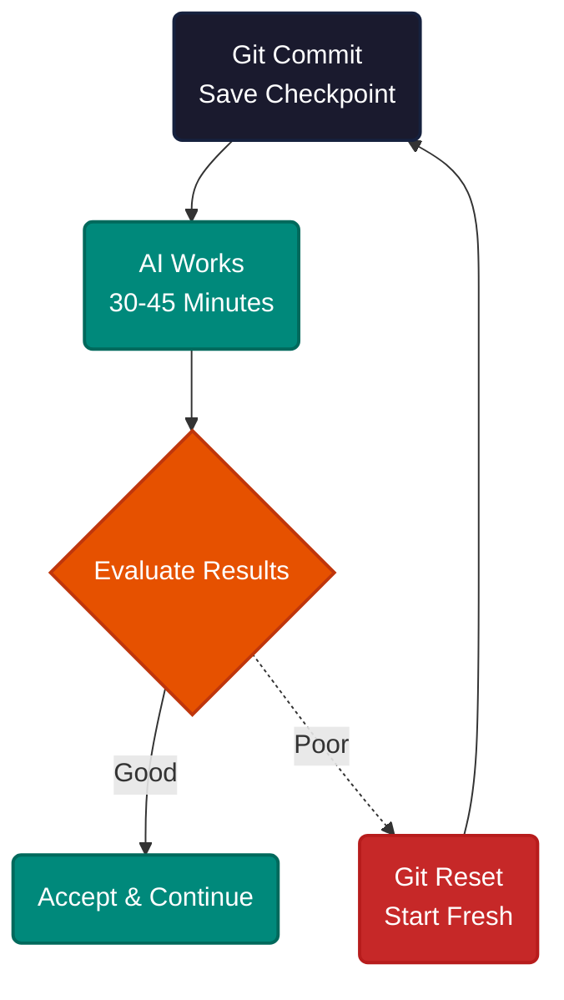
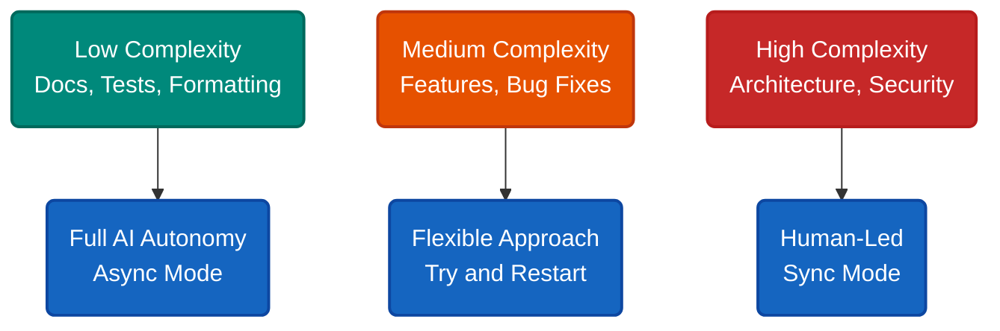
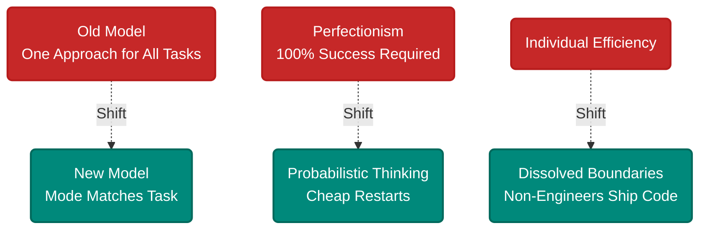

# AI Collaboration: When Teams Stop Typing and Start Directing

Designers shipping complex features solo. Marketing people building Figma plugins. Research sessions compressed from an hour to ten minutes. Security engineers resolving problems 3x faster than before.

None of this required hiring. It required changing how people work *with* AI — choosing the right collaboration mode for each task, not defaulting to one approach for everything.

Most teams treat AI as a single tool with a single interaction pattern. But architecture decisions carry different risk than writing unit tests, and exploring a new codebase is nothing like grinding through data processing. Three collaboration patterns keep emerging.

**Synchronous** is for high-stakes work. You lead the thinking, AI catches blind spots. "I'm planning approach A" — and the AI asks whether you've considered cold-start problems.

**Asynchronous** is for execution. Hand AI a clear objective and go do something else. Teams report 70% of routine coding works this way.

**Mixed exploration** is for learning. Start broad, drill down. Weeks of knowledge absorption compress into a single session.

---

When AI goes wrong, the instinct is to fix it — add more instructions, correct the output, nudge it back on track. This instinct is wrong.

Errors contaminate the context window. The bad output stays in memory, biasing every subsequent response. Corrections consume tokens that could carry useful information. The conversation spirals.

The better move: reset to the last checkpoint and start fresh. Like a slot machine — the cost of a new pull is low, and each attempt is independent.

This only works with frequent commits. The checkpoint is the safety net. Without it, restarting means losing real work.

Two more techniques compound the effect. **Dual agent specialization** — split competing objectives across separate AI conversations. One agent writes headlines, another writes body copy. Each optimizes for a single goal instead of compromising across all of them. **Visual-driven development** — paste screenshots instead of describing UIs in text. A screenshot carries layout, colors, spacing, and state without lossy compression through language.

---

The collaboration mode matters less than getting the match right. Low-complexity tasks paired with synchronous mode waste human attention. High-complexity tasks run asynchronously produce unreliable results.

**If you're an individual contributor**, start with async mode on a low-complexity task — documentation or test coverage. Build the checkpoint habit before attempting anything high-stakes.

**If you're a team lead**, the biggest lever is project documentation. A doc describing structure, coding standards, and common patterns gives AI the context it needs to work autonomously. Without it, every async task starts from scratch.

**If you're exploring new technology**, mixed mode compresses ramp-up dramatically. Ask what the architecture looks like, drill into specifics, implement with guidance. Research teams report 80% reductions in learning time.

---

The real change is not in the tooling. Three assumptions shift when teams adopt these patterns.

---

The pattern is universal: match the collaboration mode to the task, not the other way around. This is not about AI writing more code — it is about humans spending less time on execution and more time on decisions that require judgment, context, and taste.

---

**References**

1. Anthropic. "How Anthropic teams use Claude Code." *Anthropic Blog*, July 24, 2025. [anthropic.com/news/how-anthropic-teams-use-claude-code](https://www.anthropic.com/news/how-anthropic-teams-use-claude-code)
2. Anthropic internal team data: Research team 80% learning time reduction, Security Engineering 3x faster resolution, Growth Marketing ad generation from hours to minutes, Data Infrastructure 20-minute savings on Kubernetes cluster issues.
