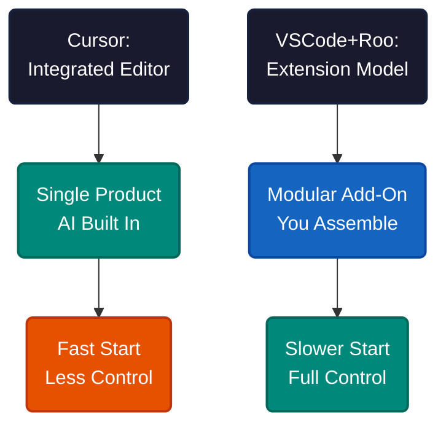
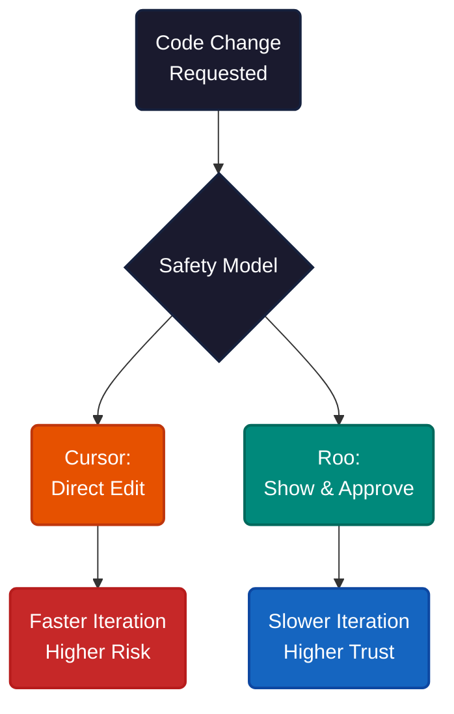
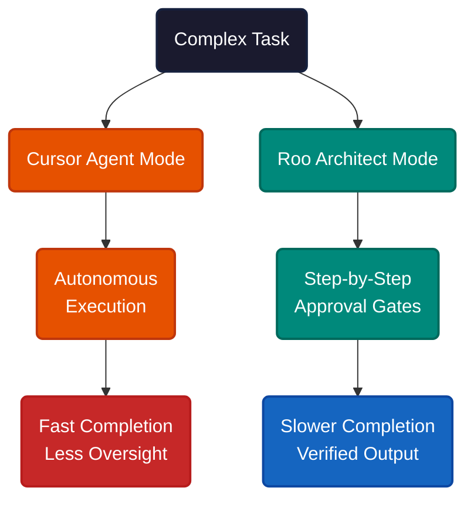
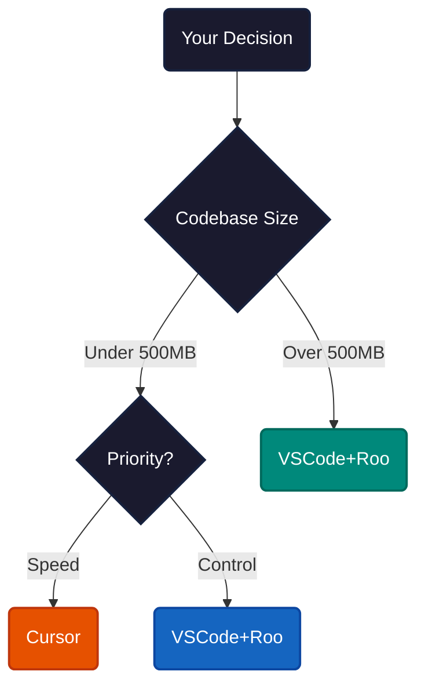

# Cursor AI Editor vs VSCode+Roo: Which AI Workflow Fits Your Development Style

It's 11 PM. You're staring at a 500-line function that needs refactoring, your deadline is tomorrow, and your AI coding tool just crashed. The choice between Cursor and VSCode+Roo is not about features. It's about whether your tool fights your workflow or disappears into it.

Pick wrong and you lose 2-3 months adapting to a workflow that resists the way you think. Developers who match correctly report saving 1.5-2 hours daily. Those who don't abandon AI tooling entirely.

Cursor bakes AI into the editor. Every feature — tab completion, chat, background agents — ships as a single product. You open it and start coding. No configuration, no plugin hunting, no assembly required. The tradeoff: you use their models, their UX decisions, their update cycle.

VSCode+Roo takes the opposite approach. Roo is an extension that bolts AI onto an editor you already own. It adds specialized modes — Code, Architect, Ask, Debug — and asks permission before every action. You choose the model, you control the flow, you keep your existing setup untouched.

Same goal, opposite bets. Cursor bets you want things to work immediately. Roo bets you want things to work your way.

---

Setup tells you a lot. Cursor gets you productive in 5 minutes with zero configuration. Roo takes 15 minutes to install and 2 weeks to master its mode-switching workflow. That investment unlocks automation Cursor cannot match — but the ramp-up cost is real.

Code safety reveals the deeper philosophical split. Cursor modifies files directly through chat and tab completion. Roo shows you each proposed change and waits for approval. One optimizes for speed. The other optimizes for trust. Neither is wrong — they serve different risk tolerances.

Large codebase performance is where most developers get burned. Cursor struggles with repositories over 500MB — background indexing slows, completions lag, the experience degrades. Roo stays responsive because it reads files on demand rather than indexing everything upfront. For enterprise teams, this difference compounds into hours daily.

Model flexibility matters more than it first appears. Cursor locks you into its built-in models. Roo supports OpenAI, Claude, local LLMs, anything with an API. Teams with privacy constraints, cost ceilings, or specific model preferences need this flexibility. Teams that just want the best default do not.

---

Both tools offer autonomous AI that can plan, research, and execute multi-step tasks. The difference is how much rope they give you.

Cursor's Agent Mode explores codebases, scaffolds projects, edits across files, runs commands, and fixes errors — all without asking. It completes well-defined tasks fast. The risk: when a task is ambiguous, the agent may charge ahead in the wrong direction.

Roo's Architect Mode structures technical plans with deliberate reasoning and approval gates at each step. You review every decision before execution. The cost is speed. The payoff is precision on production code where mistakes are expensive.

Some teams use both. Cursor for rapid prototyping and pair programming, Roo for production refactoring and complex multi-file changes. The tools are not mutually exclusive.

**If you want AI to just work**, Cursor is the shorter path. No setup, no modes, no decisions about models. You open the editor and the AI is already there.

**If you want AI under your control**, Roo is the more durable choice. You keep your VSCode setup, choose your models, approve every change, and handle large codebases without performance cliffs.

**If you manage a team**, the answer depends on your codebase size and risk tolerance more than individual preference. Small-to-medium repos with fast iteration cycles favor Cursor. Large repos with production constraints favor Roo.

---

The pattern is not Cursor vs Roo — it's integrated vs modular, and every AI-assisted tool faces the same tradeoff. Tighter integration means faster starts and less friction. Modular design means more control and longer shelf life. The right answer depends on whether your bottleneck is getting started or staying in control once you have.

---

**References**

1. Cursor. "Features." [cursor.com/features](https://cursor.com/features).
2. Roo Code. "Roo Code Documentation." [docs.roocode.com](https://docs.roocode.com).
3. VS Code Marketplace. "Roo Code Extension." [marketplace.visualstudio.com](https://marketplace.visualstudio.com/items?itemName=RooVeterinaryInc.roo-cline).
