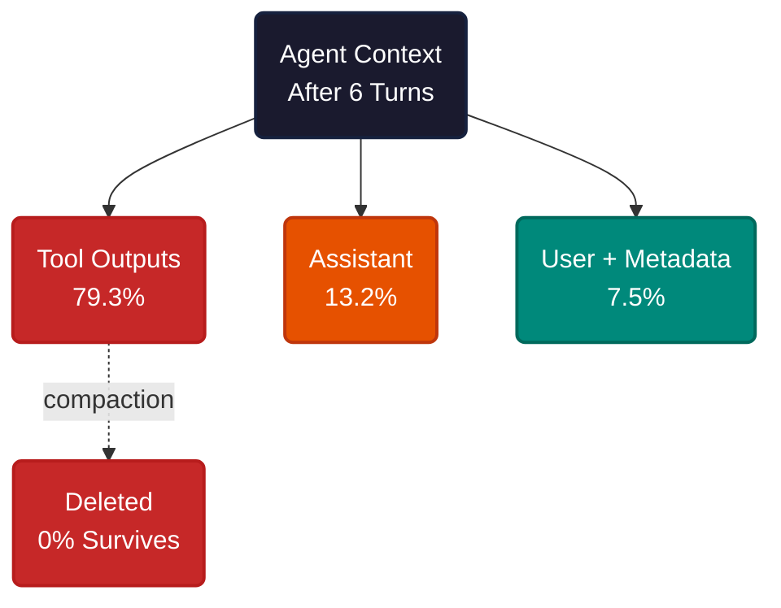
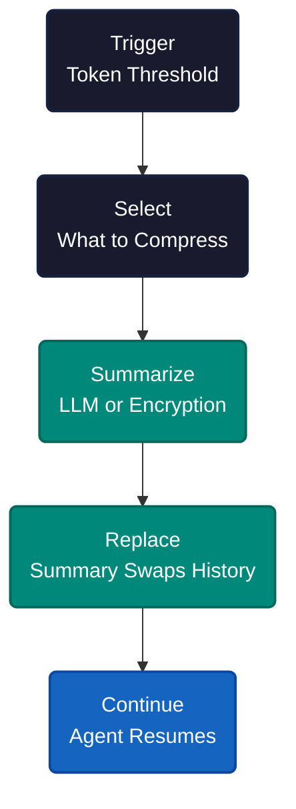
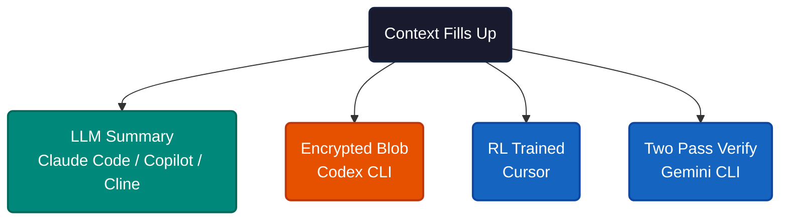
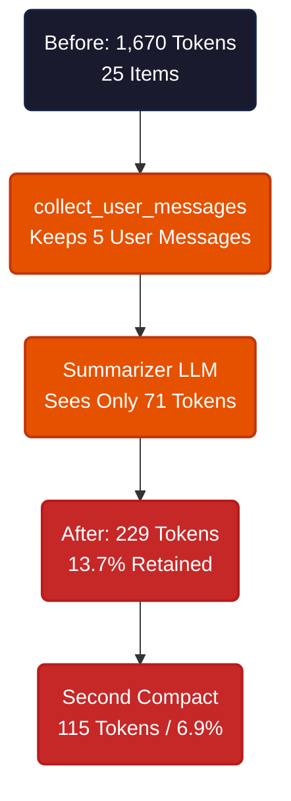
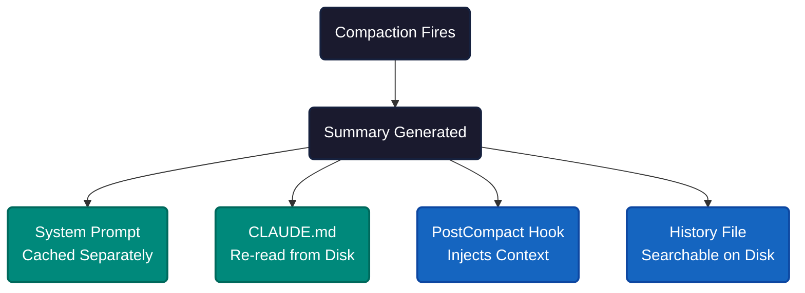

# The Context Compacting Problem

Three hours into a refactor. Forty files touched, tests passing, the agent halfway through integrating a new API. Then the context window fills up. The agent compacts — summarizing three hours of work into a few paragraphs. When it resumes, it re-reads a file it edited twenty minutes ago. Tries a fix it already rejected. Asks a question you answered an hour earlier.

This is context compacting. Every AI coding agent does it. None of them do it well enough.


Context windows are finite. Coding sessions are not. A 200K-token window sounds enormous until you see where those tokens go. In a measured six-turn debugging session with Codex CLI, tool outputs — file reads, error messages, search results — consumed 79% of all tokens. Assistant reasoning took 13%. User messages took 4%.



The bulk of an agent's context is ephemeral output that loses relevance within a few turns. But when compacting fires, it cannot always distinguish a stale grep result from the error message that holds the key to the bug.

---


Every tool follows the same five stages. Trigger. Select. Summarize. Replace. Continue.



The trigger is where tools diverge most. Gemini CLI compacts at 50% of its context window — the most aggressive threshold, firing while the model still has strong attention across all content. Claude Code fires at ~83.5%. Codex CLI's source code reveals the formula `(context_window * 9) / 10` — a hard 90%. Copilot waits until 95%.

Selection follows a universal pattern: tool outputs die first. They're the largest, lowest-value content. After pruning, older conversation turns get summarized while system instructions — CLAUDE.md, `.cursorrules`, AGENTS.md — are always protected. Every tool preserves these files across compaction.

---


Here is how the major coding agents handle compacting. No rankings — just what each tool does.

| Tool | Trigger | Strategy | Manual Command | Persistent Memory |
|---|---|---|---|---|
| **Claude Code** | ~83.5% | LLM summary (`<summary>` tags) | `/compact [focus]` | CLAUDE.md (re-read from disk) |
| **Cursor** | Near capacity | RL-trained self-summary + history-as-files | `/compress` | `.cursorrules` |
| **Copilot** | 95% | LLM summary + checkpoint snapshots | `/compact` | `copilot-instructions.md` |
| **Codex CLI** | 90% | Encrypted opaque blob (OpenAI) / LLM (others) | `/compact` | AGENTS.md |
| **Gemini CLI** | 50% | Two-pass LLM with self-correction | `/compress` | GEMINI.md + `/memory` |
| **Cline** | 80% or window-40K | LLM summary (advanced) / truncation (weak) | auto or `/new` | `.clinerules` |
| **OpenCode** | ~85-90% | LLM summary (configurable model) | auto only | Config files |



The earlier you compact, the better the summary quality (models degrade before hitting their hard limit), but the more usable context you waste. There is no consensus on the right number.

Three innovations stand out. **Codex CLI** uses encrypted server-side compression for OpenAI models — not a readable summary but an opaque blob the model decodes internally. **Cursor** trained self-summarization into their Composer 1.5 agent via reinforcement learning, producing summaries compact enough to sustain 170-turn sessions. **Gemini CLI** runs two-pass summarization where the model critiques and refines its own summary, with prompt injection defenses built into the compression prompt.

---


Codex CLI's compacting code is open source. What follows is the LOCAL compaction path — the fallback used for non-OpenAI models. For OpenAI models, the full conversation (including all tool outputs) is sent to a server-side `/responses/compact` endpoint that returns an encrypted blob. The server sees everything. But the local path reveals how a typical LLM-based summarizer actually works — and where information dies.

The session: read `src/auth.rs`, analyze the bug, run a failing test, apply a patch adding `cache::invalidate(&decoded.sub)` at line 47, check callers in `mobile.rs` and `web.rs`, run regression tests. Total: 1,670 tokens across 25 items.

When compacting triggers, this function runs:

```rust
pub(crate) fn collect_user_messages(items: &[ResponseItem]) -> Vec<String> {
    items.iter().filter_map(|item| match parse_turn_item(item) {
        Some(TurnItem::UserMessage(user)) => {
            if is_summary_message(&user.message()) {
                None  // skip previous compaction summaries
            } else {
                Some(user.message())
            }
        }
        _ => None,  // ALL other item types dropped here
    }).collect()
}
```

That `_ => None` silently drops every tool result, every assistant message, every tool call. The summarizer LLM receives only the five user messages — "fix the auth bug," "run the tests," "apply the fix," "check other callers," "run regression." It never sees the file contents, the error messages, or the patch. It cannot preserve what it cannot see.



After the first compaction, 2 of 5 ground-truth facts survived: the `cache::invalidate` fix and the `test_concurrent_refresh` failure. The fix location (line 47), the regression test content, and the fact that `mobile.rs` also calls the buggy path were all gone. After the second compaction, zero of 5 survived. In a separate incident, a Codex user working on an Eclipse JDT test saw 23 file edits across 54 minutes of work — then, after compaction at 211K tokens, the agent denied having touched any files.

The irony is in the code itself. The summary prefix tells the next model: "You also have access to the state of the tools that were used." By the time it reads this, `collect_user_messages()` has already discarded every tool state.

The issue author prototyped a fix: a pre-compaction snapshot that scans tool results by type (patches weighted 1.0, test output 0.95, file content 0.80) and packs the highest-priority facts into a fixed 2,000-token budget appended after the summary. Weighted fact recall went from 15.2% to 100%. An 84.8% improvement from 2K extra tokens — roughly 10% overhead on a 20K post-compaction context.

---


Factory.ai evaluated compaction quality across 36,611 production messages — and scored highest in its own benchmark. No provider scored above 3.70 out of 5.0 overall. File tracking — the ability to report which files were modified — topped out at 2.45 out of 5.0. Agents that compress their history cannot reliably remember what they changed.

What dies first follows a predictable order: exact numbers and error codes, then code snippets, then reasoning chains, then constraints, then architectural decisions. What survives: high-level goals, current file state, and next steps. By the third compaction round, only a vague outline remains.

The failure pattern this creates: the re-reading loop. The agent searches for information. Context fills. It compacts, losing the results. It searches again for the same information it just lost. One Codex CLI user reported the agent compacting repeatedly for two hours without patching a single file.

JetBrains published at NeurIPS 2025 that simple observation masking — replacing old tool outputs with placeholder text, no LLM involved — matched full LLM summarization quality on SWE-bench at 52% lower cost. The implication: the industry may be over-investing in expensive summarization when the simplest approach works equally well.

---


What happens after compacting determines whether the session recovers or spirals.

**Claude Code re-reads CLAUDE.md from disk** after every compaction — not from the summary, from the actual file. The system prompt survives compaction because it is architecturally separate from conversation history — compaction only summarizes conversation turns, not the system prompt. Custom "Compact Instructions" in CLAUDE.md control what the summary preserves. `PostCompact` hooks can inject additional context after compaction. And the `pause_after_compaction` API returns control to the client so it can add content before the model continues.

There is a catch. A user on GitHub issue #6354 tested systematically: after `/clear`, injected instructions were followed. After `/compact`, the same instructions were ignored — the model continued the thread described in the summary instead. The compaction summary appears to create conversational momentum that overrides re-injected instructions. The re-injection works at the infrastructure level. It doesn't always work at the behavior level.

**Cursor saves the full conversation as a searchable file.** If the summary missed something, the agent greps the history and pulls the detail back. Nothing is permanently destroyed — just moved from active context to storage.

**Copilot writes checkpoint snapshots** to `~/.copilot/session-state/` before every compaction. Combined with its agentic memory system — which stores facts with citations validated against the current branch — this gives it a two-layer recovery mechanism.



**Agent teams are the weak point.** In Claude Code, subagent transcripts are stored in separate files and survive parent compaction. But the parent's awareness of the team does not. After compaction, the lead agent continues as if no team exists — it cannot message teammates, coordinate tasks, or acknowledge the team. The data is on disk (team config at `~/.claude/teams/`), but nothing triggers a re-read of team configuration after compaction. One user described it as "the number 1 most frequent bug I hit with Agent Teams." Another reported that after 4 compactions, the lead lost its "project manager" role constraint and started doing implementation work directly — the summary preserved the concept of "use sub-agents" but lost the specific role boundary.

The current workaround: store team state in CLAUDE.md or a dedicated MEMORY.md file that gets re-read automatically. As one practitioner put it: "Context compaction becomes a non-issue because the critical state was never in-context to begin with."

Sub-agent delegation is itself a compacting mitigation. Each sub-agent works in a fresh context window. Only the final summary returns to the parent — typically 1-2K tokens instead of the 50K+ of intermediate tool calls and file reads. The verbose output stays quarantined. This prevents the parent context from ever growing to compaction size in the first place.

---


The tools that handle compacting best don't build better summarizers. They build architectures where less needs to be summarized.

**Put durable context in instruction files.** CLAUDE.md, `.cursorrules`, AGENTS.md, `copilot-instructions.md` — these survive every compaction because they're re-read from disk, not from the conversation. Project constraints, coding conventions, architectural decisions — anything you'd be upset to lose belongs here.

**Use sub-agents for heavy lifting.** File reads, test runs, code searches — anything that produces large tool output should happen in a sub-agent's isolated context. The parent stays lean.

**Use PostCompact hooks to re-inject critical state.** Claude Code's `PostCompact` hook fires after compaction completes. Anything written to stdout enters the context. Use this to remind the agent of active tasks, team state, or constraints the summary may have dropped.

**Compact proactively.** Compacting at 40-60% capacity produces better summaries than waiting for 90-95%. The model has stronger attention across all content when it's not at capacity. Gemini CLI's 50% threshold reflects this.

**Start fresh when the agent loops.** If it re-reads files it just edited or re-proposes solutions it already tried, that's the re-reading loop. More compaction rounds won't fix it. Start a new session with a clear handoff instead.

---

The pattern is universal: every tool that runs long enough needs a way to forget gracefully. The industry is converging on an uncomfortable insight — the best compaction is the compaction you don't need. Short, focused sessions. File-based state that survives any number of compactions. Sub-agents that keep parent contexts lean. The tools that handle long sessions best don't build better summarizers — they build architectures where less needs to be remembered in the first place.

---

**References**

1. Anthropic. "Automatic context compaction." [platform.claude.com/docs/en/build-with-claude/compaction](https://platform.claude.com/docs/en/build-with-claude/compaction).
2. OpenAI. "Compaction guide." [developers.openai.com/api/docs/guides/compaction](https://developers.openai.com/api/docs/guides/compaction).
3. Cursor. "Self-summarization." [cursor.com/blog/self-summarization](https://cursor.com/blog/self-summarization).
4. Cursor. "Dynamic context discovery." [cursor.com/blog/dynamic-context-discovery](https://cursor.com/blog/dynamic-context-discovery).
5. JetBrains Research. "Efficient context management for LLM-powered agents." [blog.jetbrains.com/research/2025/12/efficient-context-management](https://blog.jetbrains.com/research/2025/12/efficient-context-management/).
6. Factory.ai. "Evaluating context compression." [factory.ai/news/evaluating-compression](https://factory.ai/news/evaluating-compression).
7. GitHub. "Building an agentic memory system for Copilot." [github.blog/ai-and-ml/github-copilot/building-an-agentic-memory-system-for-github-copilot](https://github.blog/ai-and-ml/github-copilot/building-an-agentic-memory-system-for-github-copilot/).
8. OpenAI Codex CLI. "Issue #14589: Compaction silently discards all tool outputs." [github.com/openai/codex/issues/14589](https://github.com/openai/codex/issues/14589).
9. Anthropic. "Effective context engineering for agents." [anthropic.com/engineering/effective-context-engineering-for-ai-agents](https://www.anthropic.com/engineering/effective-context-engineering-for-ai-agents).
10. Claude Code. "Issue #23620: Agent team lost on compaction." [github.com/anthropics/claude-code/issues/23620](https://github.com/anthropics/claude-code/issues/23620).
11. Morph. "Compaction vs summarization." [morphllm.com/compaction-vs-summarization](https://www.morphllm.com/compaction-vs-summarization).
12. Badlogic. "Compaction research across 4 tools." [gist.github.com/badlogic/cd2ef65b0697c4dbe2d13fbecb0a0a5f](https://gist.github.com/badlogic/cd2ef65b0697c4dbe2d13fbecb0a0a5f).
13. Chroma Research. "Context rot." [research.trychroma.com/context-rot](https://research.trychroma.com/context-rot).
14. Claude Code. "Hooks guide." [code.claude.com/docs/en/hooks-guide](https://code.claude.com/docs/en/hooks-guide).
