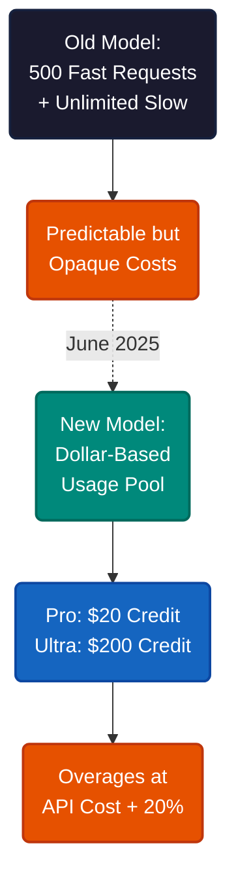
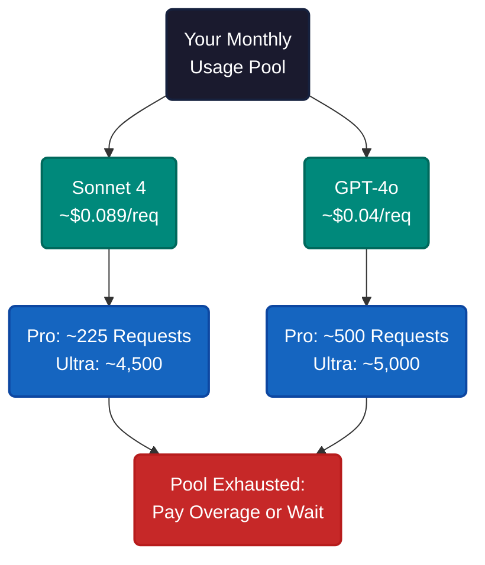
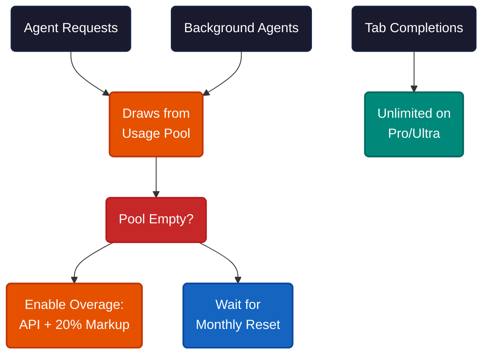
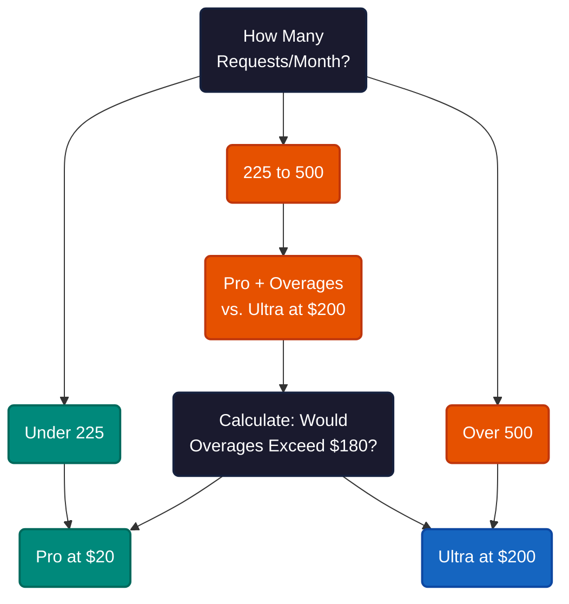

# Cursor AI's 2025 Billing Model

"My Cursor bill jumped from $20 to $180 last month." Cursor's June 2025 billing overhaul replaced a simple request-count system with usage-based credits. Thousands of developers got surprise charges. Here's what actually changed, what each plan costs, and how to pick the right one.

Before June 2025, Pro gave you 500 "fast" requests and unlimited "slow" requests per month. You always got an answer — sometimes you just waited longer. The new model scrapped that entirely. Now every plan gets a dollar-denominated usage pool: $20 for Pro, $200 for Ultra. Once you burn through it, you either stop or pay overages at API cost plus a 20% markup.

The shift matters because "unlimited slow" masked real costs. Under the old system, heavy users consumed expensive API calls that Cursor absorbed. The new model passes that cost through. Cursor's CEO acknowledged the rollout was poorly communicated and offered refunds for charges between June 16 and July 4, 2025.

---

Five plans now exist. Here's what matters for each.

| Plan | Monthly Cost | What You Get |
|---|---|---|
| **Hobby** | Free | Limited agent requests, limited tab completions |
| **Pro** | $20 ($192/yr) | ~225 Sonnet 4 requests, unlimited tabs, background agents |
| **Ultra** | $200 ($2,400/yr) | ~4,500 Sonnet 4 requests, 20x Pro usage, priority features |
| **Teams** | $40/user ($384/yr) | Privacy mode org-wide, admin dashboard, SSO |
| **Enterprise** | $65/user (annual only) | 1,000 pooled requests/seat, spending caps, SCIM |

Enterprise requires 25 seats minimum ($19,500/year). All other plans get a 20% discount for annual billing.

The request counts above assume Sonnet 4 at roughly $0.089 per request. Cheaper models stretch further; expensive ones burn faster. Different models, different math.

---

Not everything costs the same. Agent requests (chat, code generation, debugging) draw from your pool. Background agents — automated assistants that run in isolated VMs while you work — draw from it too, and they draw fast. Active background agents can consume $40+ per hour because they fire requests continuously without waiting for you.

Tab completions are unlimited on Pro and Ultra. They don't touch your usage pool. Bugbot (the code review assistant) does count toward usage on Pro.

**If you're a solo developer**, the danger zone is background agents. They only run with Max Mode models, which forces usage-based billing. Set spend limits when you first enable them. Monitor the billing dashboard. Disable them in Settings if you don't need continuous automated analysis.

**If you're a team lead**, Enterprise's pooled model changes the math. One thousand requests per seat per month, shared across the team. Heavy users draw from light users' surplus. You get a real-time dashboard, spending caps, and the option to toggle overages on or off.

---

The decision is simpler than the pricing page suggests.

**If you're a light user** (under 225 Sonnet 4 requests), Pro at $20 covers you. Unlimited tab completions and background agent access included.

**If you're in the gray zone** (225-500 requests), do the math. Pro overages cost API price plus 20%. If your typical overage would exceed $180, Ultra is cheaper. If not, stay on Pro.

**If you're a heavy user** (500+ requests), Ultra at $200 gives you roughly 4,500 Sonnet 4 requests and priority access to new features.

**If you're managing a team**, Enterprise's pooled model and spending caps matter more than per-seat cost. The admin dashboard and SCIM integration justify the premium over Teams for organizations above 25 seats.

---

The pattern here is not unique to Cursor — it's the entire AI tooling industry shifting from flat-rate to consumption-based pricing. GitHub Copilot, Windsurf, and others face the same pressure: AI inference costs real money per request, and "unlimited" plans are unsustainable as usage grows. The question for any AI coding tool is not whether usage-based billing arrives, but how transparently it gets communicated when it does.

---

**References**

1. Cursor. "Pricing." [cursor.com/pricing](https://cursor.com/pricing).
2. Cursor. "Enterprise Plan Details." [cursor.com/enterprise](https://cursor.com/enterprise).
3. Cursor CEO response on billing changes, June-July 2025 refund period.
