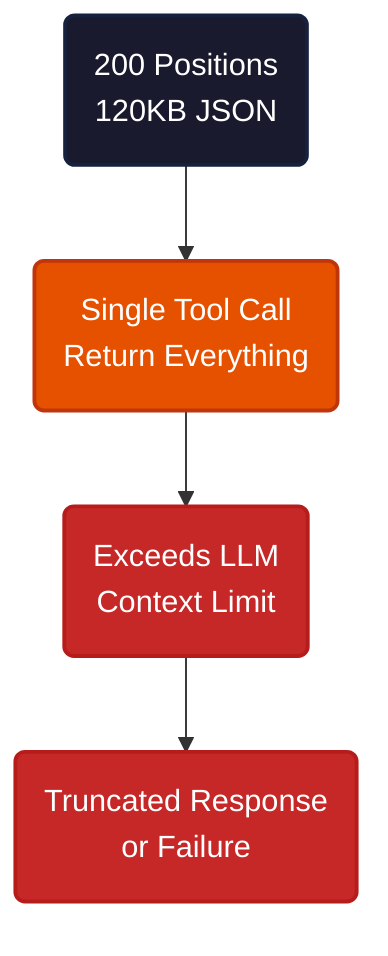
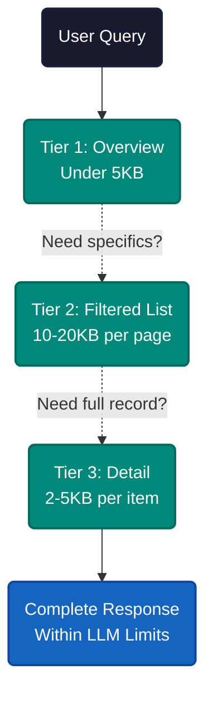
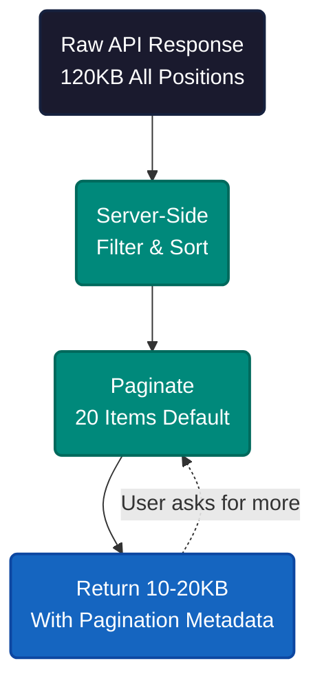

# Designing MCP Tools for Large Trading Data

A TradeStation account with 200 positions generates 120,000 characters of JSON. ChatGPT's plugin limit is 100,000 characters. The data does not fit. And this is a single account — professional traders manage 50 to 500 positions across multiple accounts, plus open orders and trade history.

The instinct is to truncate. Send less data, strip fields, compress output. But truncation is the wrong frame. The problem is not the volume of data — it is that the tool sends everything at once instead of what the user actually needs right now.


Each position contains roughly 600 characters of JSON — symbol, quantity, market value, P&L, margin requirements, timestamps. Multiply by 200 positions and you get 120KB of raw data. Current LLM limits make this unworkable:

| Platform | Limit |
|---|---|
| ChatGPT Plugins | 100,000 characters |
| GPT-4 | ~24,000 words (32k tokens) |
| Claude | Works best under 50k tokens |

Most MCP tool implementations treat every query the same way: fetch all positions, serialize to JSON, return the blob. The LLM either chokes on the size or wastes its context window parsing fields the user never asked about.



The fix is structural. Instead of one tool that returns everything, split the data into tiers that match how traders actually think — dashboard first, then drill down.

---


Traders need 5 to 7 data points in the first 30 seconds. This cognitive limit (the 5 plus-or-minus 2 rule from psychology) maps directly to a progressive disclosure pattern: show the summary, then the filtered list, then the full record.

**Tier 1 — Overview** returns portfolio health in under 5KB. Total value, P&L, top gainers and losers, concentration risk. Enough to answer "How am I doing?" without touching individual positions.

**Tier 2 — Lists** returns paginated, filtered subsets at 10-20KB per page. The user asks for losing positions, options expiring this week, or the 20 largest holdings. Server-side sorting and filtering keep the response predictable.

**Tier 3 — Details** returns the complete record for 1-10 specific symbols at 2-5KB per item. Every field, every metric. This only fires when the user explicitly drills into a position.



The key design choice: each tier is a separate MCP tool, not a parameter on a single tool. The LLM picks the right tier based on the user's question. "What's my P&L?" triggers Tier 1. "Show losing positions" triggers Tier 2. "Details on AAPL" triggers Tier 3. The LLM never loads data the user did not ask for.

---


Here is what Tier 2 looks like in practice — the list tool with pagination, filtering, and server-side sorting:

```json
{
  "tool": "list_positions",
  "parameters": {
    "account_id": "31000261",
    "filter": "losing",
    "sort_by": "unrealized_pl",
    "limit": 20,
    "offset": 0
  },
  "response": {
    "total_count": 31,
    "returned_count": 20,
    "has_more": true,
    "next_offset": 20
  }
}
```

Three design choices matter here. First, default limit of 20 items — enough to be useful, small enough to fit any context window. Second, offset-based pagination so the LLM can request the next page. Third, server-side sorting because LLMs make arithmetic errors when sorting large datasets themselves.



The same pattern extends to orders and trade history. For time-sensitive data like orders, the tool prioritizes urgency — stop losses near trigger price, large pending orders — before returning the full list. For historical data, period summaries come first, raw trade lists only on request.

---


Progressive disclosure only works if the tools respond fast enough to feel conversational. Caching fills that gap. Identical queries get cached for 30-60 seconds — long enough to avoid redundant API calls during a conversation, short enough to reflect market moves.

Smart defaults adapt to context. During market hours, tools return real-time prices and active orders. After hours, they shift to summaries and next-day preparation. Near options expiration, they surface expiring contracts without being asked.

When a response would still exceed limits — 450 positions with no filter applied — the tool returns structured guidance instead of failing silently:

```json
{
  "error": "response_too_large",
  "message": "450 positions exceed limit. Please add filters.",
  "suggestions": ["filter by account", "use pagination"]
}
```

**If you build MCP tools for any data-heavy domain**, the three-tier split applies directly. Financial data, inventory systems, monitoring dashboards — any domain where the raw dataset exceeds LLM context limits benefits from separating overview, list, and detail into distinct tools.

**If you use AI assistants with trading platforms**, ask whether the integration paginates and filters server-side, or whether it dumps everything into the prompt. The difference determines whether the tool works with 20 positions or 200.

---

The pattern is not about trading data — it is about respecting two constraints at once. Humans process 5 to 7 items before losing the thread. LLMs process a fixed window before losing the context. Progressive disclosure is not a workaround for limited AI — it is how information should flow when both the reader and the machine have finite attention.

---

**References**

1. TradeStation API Documentation. "Get Positions." [tradestation.com](https://api.tradestation.com/docs/specification/get-accounts-accountid-positions)
2. Miller, George A. "The Magical Number Seven, Plus or Minus Two." Psychological Review, 1956.
3. Anthropic. "Model Context Protocol Specification." [modelcontextprotocol.io](https://modelcontextprotocol.io)
4. OpenAI. "ChatGPT Plugins Documentation." [platform.openai.com](https://platform.openai.com/docs/plugins)
