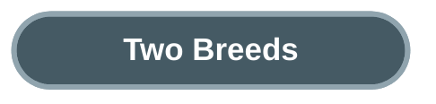
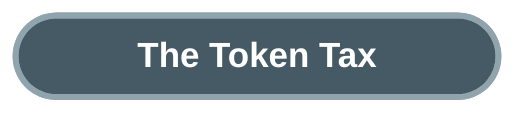
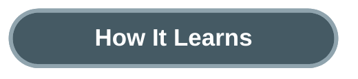
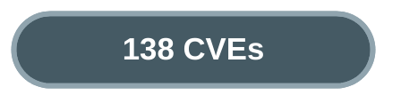

# Hermes Agent vs OpenClaw: Two Paths to a Self-Evolving Agent

A single Python class. Roughly ten thousand lines. The conversation loop, tool dispatch, memory management, prompt building, and self-evolution triggers — all in one file. Every software engineering textbook says this is wrong. Reddit called it "vibe coded slop."

It has zero known security vulnerabilities. Its competitor — a clean, modular TypeScript monorepo with proper separation of concerns — has 138.

**Hermes Agent** v0.8.0 (Nous Research, Python, Feb 2026, 57K GitHub stars) and **OpenClaw** v2026.4 (Peter Steinberger / OpenClaw Foundation, TypeScript, Nov 2025, 355K stars) are the two leading open-source frameworks that let AI agents improve themselves between conversations. One took the monolith path. The other took the modular path. The results challenge assumptions about what "good architecture" means when the software has a conversation loop at its center.

Hermes Agent puts everything in one place. A single class in `run_agent.py` handles the conversation loop, decides which tools to call, manages memory, compresses context when it gets too large, and triggers self-improvement — all within the same execution context. External systems connect through a gateway layer (~15 messaging platforms, IDE adapters, batch runners), but they all feed into the same monolith. Under 300 files, roughly 200K lines of core code.

OpenClaw distributes responsibility across layers. A persistent Gateway server receives messages over WebSocket. A Command Queue serializes requests into lanes. A Pi Embedded Runner — wrapping an upstream dependency called `pi-coding-agent` imported across hundreds of source files — executes the actual agent loop. Memory lives in a separate Host SDK. Skills and channels are plugins. Over 3,500 files, 350-500K lines.

The architectural choice runs deeper than code organization. Hermes's monolith means the conversation loop has direct access to every subsystem — memory, tools, compression, self-evolution — without crossing a process boundary. OpenClaw's modularity means each subsystem communicates through defined interfaces. Elegant on a whiteboard. But every interface is a contract that has to be enforced at runtime. Every module boundary is a place where assumptions can diverge.

![Hand-drawn pencil sketch showing two buildings side by side. Left: a single massive skyscraper labeled HERMES with all functions visible through the windows on different floors — tools, memory, compression, evolution — all connected by internal staircases. Right: a campus of smaller buildings labeled OPENCLAW connected by exposed walkways and bridges between them — gateway building, runner building, memory building, skills building. The skyscraper looks dense but solid. The campus looks elegant but the walkways between buildings are exposed to the elements.](images/god-class-vs-campus-sketch.jpg)

OpenClaw looks like the textbook answer. Clean separation of concerns. Well-defined module boundaries. A gateway pattern straight out of any distributed systems book. Hermes looks like a first draft that shipped. The evidence says the first draft is doing fine.

---

Token overhead is the most underrated dimension in agent framework comparison. Every token spent on infrastructure — system prompts, tool definitions, memory snapshots, skill catalogs — is a token unavailable for reasoning. When frameworks differ by multiples, the impact compounds across every conversation.

Hermes starts a CLI session with approximately 19,000 tokens of overhead. OpenClaw starts with 40,000 to 60,000 in CLI mode, and 88,000 to 166,000 with the full gateway stack. The gap is 2-7x depending on configuration.

Where does the difference come from? Three places.

Memory. Hermes uses a hard-capped curated notepad: MEMORY.md is limited to 2,200 characters (~800 tokens) and USER.md to 1,375 characters (~500 tokens). The agent must self-edit to stay within limits — there is no automatic consolidation. These files are frozen into the system prompt at session start and do not change mid-conversation. Total: ~1,300 tokens, fixed. OpenClaw takes the opposite approach: MEMORY.md grows without bound on disk. What gets injected into context is truncated at 20,000 characters (~5,000 tokens) per file. Daily notes accumulate as separate files; the agent is instructed to read today and yesterday on session start (not auto-injected, but effectively always loaded). The Dreaming system (opt-in) consolidates older memories at 3 AM. Total injected: variable, typically 5,000-15,000 tokens depending on how much the agent has learned. The OpenClaw memory is richer and grows over time. It also costs 4-12x more context per session.

Tool definitions. Hermes advertises 38 default tools in CLI mode (more exist but are gated behind environment flags). OpenClaw advertises a comparable number of tools but with heavier definitions — roughly 15,000-20,000 tokens — plus a skill catalog at roughly 100 tokens per skill that scales linearly with install count.

Bootstrap context. OpenClaw loads AGENTS.md, SOUL.md, TOOLS.md, and other workspace files totaling ~37,500 tokens. An entire operating environment definition packed into the prompt. Hermes has no equivalent; its agent behavior is encoded in the class itself.

The cost comparison follows the token comparison. Both frameworks cost 5 to 30 USD per month for typical personal use. At scale, the gap widens. One OpenClaw user reported cutting monthly costs from 420 to 168 USD through aggressive optimization. A Hermes user reported 2.6 million tokens in a 12-hour intensive session — 40 to 80 USD at frontier model pricing.

This is not just about money. A 200K-token context window with 88K tokens of overhead gives the model 112K tokens to work with. The same window with 19K of overhead gives it 181K tokens. That's 62% more room for conversation history, code analysis, and reasoning chains. The agent with more room to think does not produce better results because the model is smarter — it produces better results because the infrastructure steals less of its attention.

---

Both frameworks claim their agents improve over time. The mechanisms differ in ways that reveal different philosophies about what intelligence improvement means.

Hermes bakes self-evolution into the conversation loop. Periodically (at configurable intervals), a background review agent spawns as a separate thread, receives the full conversation history plus a review prompt, and runs up to 8 iterations to decide whether to save memories or create skill files. A similar process fires on tool-use milestones to identify non-trivial approaches worth preserving as reusable playbooks.

This is not free. The background review agent creates a new AIAgent instance using the same model as the main conversation — if you are running a frontier model, the review agent runs on that same frontier model. It makes additional API calls over the full conversation context. The cost is hidden (no separate line item, no explicit budget) but real. The trade-off is that self-improvement happens inline, during the conversation, with results available in the same session.

OpenClaw takes a different path. Self-evolution happens outside the conversation, through scheduled plugins. The Capability Evolver skill — 35,000+ installs, the most popular on ClawHub — runs on-demand or via cron job with 7 configurable strategies. The Dreaming system consolidates memory via a single daily sweep at 3 AM (default cron), running three phases in sequence: Light (signal ingestion and deduplication), REM (cross-referencing for patterns), then Deep (promoting high-value entries to long-term memory). Higher-frequency schedules are configurable for heavy-use agents. Cost: 10-15 explicit LLM calls per day, configurable budget of 800K tokens per day.

Both approaches cost real API calls. The difference is timing and visibility. Hermes pays for evolution inline — hidden in the main conversation's bill, periodic, using the same expensive model. OpenClaw pays for evolution separately — scheduled, budgeted, visible as a distinct cost center.

The deeper question: should self-improvement be inline or scheduled?

Hermes says inline. The agent notices its own patterns while working and saves them immediately. Elegant but inflexible — you cannot choose a "repair-only" or "innovate" strategy. It just runs, and you pay for it whether or not the review produces useful insights.

OpenClaw says scheduled. Self-improvement is a capability you compose, configure, and tune. You pick from 7 strategies (balanced, innovate, harden, repair-only). You set the budget. You run it when you want. More operational overhead — but improvements only apply to future sessions, not the current one.

Neither approach is wrong. The trade-off is feedback loop tightness vs cost control. Hermes adapts faster within a session because it reviews inline. OpenClaw gives you a budget dial and strategy selector at the cost of delayed feedback.

One caveat: Hermes also has a research project called GEPA — Genetic-Pareto Prompt Evolution, published as an ICLR 2026 Oral paper. Impressive on paper but completely disconnected from the main codebase. Zero references, no shared interface. A research prototype, not a shipping feature. OpenClaw has similar external projects (OpenClaw-RL, MetaClaw). Both frameworks have research ambitions beyond what ships today.

---

Between February and April 2026, security researchers disclosed 138 CVEs against OpenClaw. CVE stands for Common Vulnerabilities and Exposures — a public registry where security flaws are tracked, scored, and cataloged so that anyone running the software knows what risks they face. When a CVE is filed, it means a researcher found a way to break in, reported it, and the vulnerability is now public knowledge. A severity score from 0 to 10 rates how dangerous it is: anything above 7.0 is High, above 9.0 is Critical (an attacker can take full control remotely, often without credentials).

OpenClaw accumulated 138 of these in 63 days. 2.2 per day. Seven rated Critical. Forty-nine rated High. In the same period, Hermes had zero.

The numbers alone are damning. The root causes are more instructive.

CVE-2026-22172 (severity 9.9/10): during the WebSocket handshake, the client declares its own permission scopes. Self-escalate to admin. No exploit toolkit required. CVE-2026-32922 (severity 9.9/10): the device token rotation endpoint bypasses scope validation. A pairing token — meant for initial setup — becomes full administrative remote code execution. CVE-2026-32048 (severity 7.7/10): sandboxed sessions spawn unsandboxed children. Security restrictions are not inherited across the module boundary.

These are not exotic attack vectors. They are authorization architecture failures — the kind that happen when security context does not propagate cleanly across module boundaries. The WebSocket handshake trusts the client. The token rotation endpoint skips scope checks. The sandbox does not inherit. Each failure happens at an interface between two components that made different assumptions about trust.

Default security posture tells the story in miniature. OpenClaw ships open: no restrictions out of the box, no command allowlist, no approval required, sandbox mode set to "off" by default. Docker and Podman sandboxes exist but must be manually enabled. Security is opt-in. Hermes ships closed: unknown users must pair via cryptographic code, dangerous commands require approval, and a Rust binary called Tirith (enabled by default) scans every command for terminal injection, invisible Unicode, pipe-to-shell patterns, and shell injection. Docker sandbox is available with all capabilities dropped, privilege escalation disabled, and PID limits enforced. Modal and Daytona provide cloud sandbox alternatives.

The supply chain dimension makes it worse. OpenClaw's ClawHub skill marketplace has tens of thousands of community skills. 824+ have been identified as malicious — credential harvesters, cryptominers, backdoors. Hermes's Skills Hub runs a quarantine with hash-chained audit log. The scale of the supply chain problem differs by orders of magnitude.

The uncomfortable observation: modularity created the attack surface. More module boundaries means more places where security context can leak, where trust assumptions can diverge, where an attacker can find a seam. Hermes's monolith has fewer boundaries to defend. This does not mean monoliths are inherently more secure. It means security in modular systems requires explicitly propagating trust across every interface — and 138 CVEs in 63 days is evidence that OpenClaw's architecture grew faster than its security model could follow.

The verdict is unambiguous: Hermes is the more secure framework today. Zero CVEs, closed-by-default posture, active command scanning, and a smaller attack surface. If your agent touches the internet or handles sensitive data, this dimension alone should drive the decision.

---

Peter Steinberger created OpenClaw (originally "Clawdbot") in late 2025. It went viral. By January 2026, it had more GitHub stars than React. On February 14, 2026, Steinberger announced he was joining OpenAI to work on "next-generation personal agents." He handed the project to a 501(c)(3) foundation — announced but, as of April 2026, not yet formalized. The foundation's primary funder is OpenAI. The project's creator now works for OpenAI.

Nous Research, behind Hermes Agent, has raised 65-70 million USD in venture funding (50M Series A at a 1B token valuation, led by Paradigm). Four co-founders actively involved. Revenue from API products, enterprise contracts, and the Psyche network. Hermes is a strategic product for a funded company with aligned incentives.

OpenClaw has 6.2x more GitHub stars, 5.3x more contributors, and a skill ecosystem 20x larger. It also has 6x more open issues (18,211 vs 3,008), an unfunded governance structure, and a creator whose attention is split between his employer and the project he founded.

Stars measure interest. They do not measure sustainability. The question that matters is who shows up when something breaks at 2 AM, and whether the answer depends on a single person's bandwidth at a competing company.

One concrete signal: migration tooling exists from OpenClaw to Hermes (`hermes claw migrate` handles SOUL.md, MEMORY.md, skills, and platform configs in about 5 minutes). No reverse tool exists. Migration is a one-way door. When one framework invests in acquiring users from the other and the reverse path does not exist, that is directional evidence about where the ecosystem sees momentum shifting.

---

The monolith does not always win. Hermes has real weaknesses that OpenClaw's architecture handles better.

**If you need to reach users across many messaging platforms**, OpenClaw is the only serious option. Over 50 channel adapters including first-class WhatsApp support, a web Control UI, beta mobile apps, and community adapters for platforms Hermes does not touch. Hermes has roughly 15 adapters and no mobile presence.

**If you need sophisticated multi-agent workflows**, OpenClaw's gateway-mediated subagents with persistent registries, orphan recovery, and state sharing are more mature than Hermes's thread-based ephemeral subagents (max 3 parallel, depth 2 max).

**If your users are not developers**, OpenClaw's config-first approach (define your agent in SOUL.md + AGENTS.md + YAML, no code required) is genuinely more accessible. The onboarding wizard, community guides, and tens of thousands of ready-to-install skills lower the barrier to entry.

**If you need the best memory search**, OpenClaw combines vector similarity search with full-text keyword search, then reranks results for diversity. Multiple embedding providers (OpenAI, Gemini, Voyage, local models) are supported. Hermes uses simpler keyword-only search via SQLite. OpenClaw requires more infrastructure, but handles "find something similar to X" queries better.

**If you need formal planning**, OpenClaw's built-in plan tool with execution contracts and heartbeat-driven proactive work is more structured than Hermes's reactive, LLM-driven approach.

Neither framework handles enterprise multi-tenancy with compliance certification. Neither supports screen readers, internationalization, or right-to-left languages. Both degrade in long sessions — Hermes logged 69% token waste in a 12-hour session; OpenClaw can deadlock on overflow. These are personal assistant tools. Treat them accordingly.

| Who you are | Choose | Why |
|---|---|---|
| Solo developer, personal AI assistant | Hermes | Lean, inline self-improvement, lower token overhead |
| Team building customer-facing messaging bots | OpenClaw | 50+ channels, config-first, mobile presence |
| ML researcher training models from agent traces | Hermes | Rare among OSS frameworks in closing the reinforcement learning loop |
| Non-developer wanting an AI assistant | OpenClaw | No code needed, GUI, guided onboarding |
| Security-conscious deployment | Hermes | 0 CVEs, closed-by-default, Tirith scanning |
| Cost-sensitive at scale | Hermes | 2-7x smaller token baseline |
| Wanting the largest skill ecosystem | OpenClaw | 44,000+ skills (vet carefully — 824+ were malicious) |

---

Agent architecture operates under different constraints than application architecture. In regular software, loose coupling lets different teams iterate independently — and that is the right trade-off when components have different lifecycles. In an agent framework, the conversation loop, memory, tools, and self-evolution are so deeply intertwined that separating them creates seams. Seams are where security breaks, tokens leak, and context gets lost. The lesson from these two frameworks is not that monoliths are good and modularity is bad. It is that the rules change when your software's core abstraction is a conversation — not decoupling components, but keeping coherence across a system that is supposed to think.

---

**References**

1. Hermes Agent. v0.8.0, commit af9caec (2026-04-11). [github.com/nousresearch/hermes-agent](https://github.com/nousresearch/hermes-agent).
2. OpenClaw. CalVer 2026.4.11, commit 545490c (2026-04-11). [github.com/openclaw/openclaw](https://github.com/openclaw/openclaw).
3. r/LocalLLaMA. Community discussion on Hermes Agent code quality. [reddit.com/r/LocalLLaMA](https://reddit.com/r/LocalLLaMA).
4. CVE-2026-22172. WebSocket scope self-escalation (CVSS 9.9). [nvd.nist.gov](https://nvd.nist.gov).
5. CVE-2026-32922. Token rotation scope bypass (CVSS 9.9). [nvd.nist.gov](https://nvd.nist.gov).
6. CVE-2026-25253. WebSocket hijacking RCE (CVSS 8.8). [nvd.nist.gov](https://nvd.nist.gov).
7. Peter Steinberger. OpenAI departure announcement (Feb 14, 2026). [x.com/steipete](https://x.com/steipete).
8. Nous Research. Series A announcement (50M at 1B token valuation). [nousresearch.com](https://nousresearch.com).
9. OpenClaw ClawHub. Malicious skills disclosure (824+ identified). [github.com/openclaw/openclaw/discussions](https://github.com/openclaw/openclaw/discussions).
10. GEPA. "Genetic-Pareto Prompt Evolution." ICLR 2026 Oral. [arxiv.org/abs/2507.19457](https://arxiv.org/abs/2507.19457).
