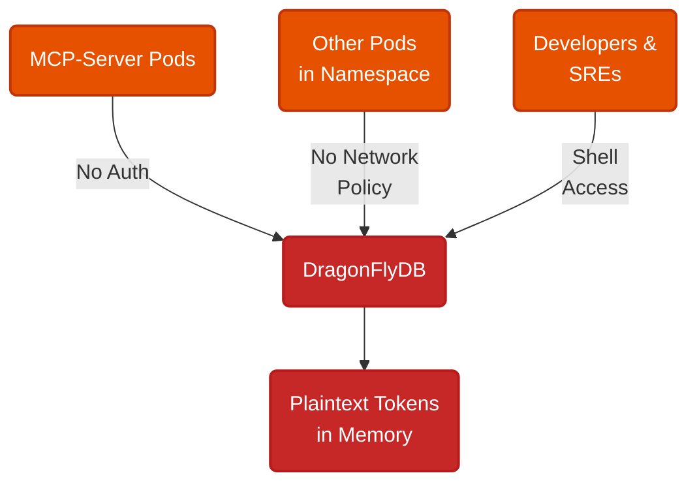
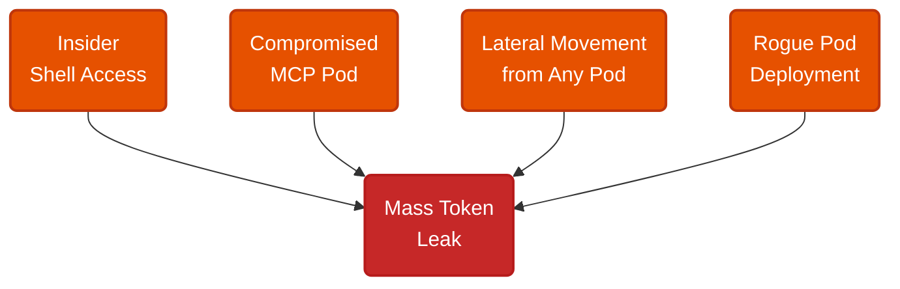
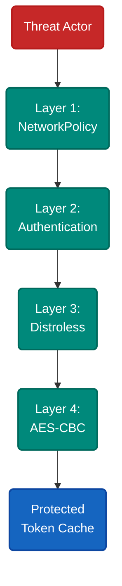
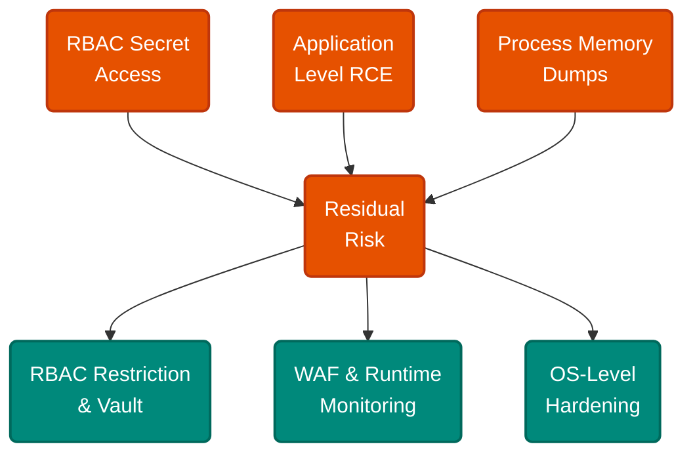

# Four Layers Between a Token Cache and a Breach

A DragonFlyDB pod sits in a Kubernetes namespace. No authentication between it and the MCP-server pods that use it. No network policy restricting access. Tokens stored in plaintext. Shell access enabled on every pod in the namespace.

Any pod can read every cached token. Any developer with namespace access can shell in and dump them. One compromised pod, one curious insider, and every user's OAuth access token is exposed.

The cache holds OAuth access tokens, refresh tokens, and client credentials for a trading platform. Each token grants direct access to a user's brokerage account. The current architecture has four open paths to those tokens.

No network segmentation means any pod connects to the cache through default Kubernetes networking. No authentication means connections require zero credentials. Shell access means SREs and developers routinely log into pods for debugging — and every token is one command away. Plaintext storage means whoever reaches the data reads it immediately.

---

Four vectors lead to the same outcome: a mass token leak granting full customer account access.

Direct insider access — shell into the DragonFlyDB pod or any MCP-server pod and extract tokens from memory. Compromised MCP-server — remote code execution chains into unauthenticated cache queries. Lateral movement — compromise any pod in the namespace, then pivot to the cache through unrestricted networking. Unauthorized deployment — spin up a new pod in the namespace and connect directly to the cache.

Each vector exploits a different gap. Insider access bypasses network controls entirely. Compromised pods bypass authentication that was never required. Lateral movement exploits missing segmentation. All four converge on the same unprotected cache.

---

No single control blocks every vector. Defense requires layers that overlap.

**Layer 1 — NetworkPolicy.** Restricts DragonFlyDB access to MCP-server pods only using label-based ingress rules. Blocks lateral movement, unauthorized pods, and accidental deployments from reaching the cache.

**Layer 2 — Authentication.** Enforces credentials between MCP-server and DragonFlyDB. Even with network access, an attacker needs valid credentials to query the cache.

**Layer 3 — Distroless images.** Removes shell binaries and debugging tools from all pods. Eliminates interactive shell access as an attack path entirely.

**Layer 4 — AES-CBC encryption.** Encrypts tokens at rest in the cache with a random initialization vector per encryption operation. Identical tokens produce different ciphertext, preventing pattern detection. Protects against storage-layer attacks: backups, snapshots, memory dumps to disk.

Together, the four layers reduce the attack surface by 75-80%. NetworkPolicy handles network-level threats. Auth handles credential-level threats. Distroless handles interactive access. Encryption handles data at rest. Each layer blocks a different class of attack that the others miss.

---

Residual risks require process controls, not infrastructure changes.

A sophisticated insider with RBAC access to Kubernetes secrets can extract auth credentials and the encryption key directly. Application-level remote code execution can query the cache through the legitimate MCP-server code path, bypassing network and auth layers. Memory dumps of running processes capture tokens in their decrypted state.

These gaps close through RBAC restriction, secret management systems like Vault, runtime security monitoring, and credential rotation. The required attacker sophistication shifts from "shell into any pod" to "compromise the secret management chain" — a fundamentally different threat level.

---

The pattern applies to any in-memory cache holding sensitive tokens in a shared-tenancy environment. No single layer is sufficient. Each blocks a different class of attack, and the residual risk shifts from infrastructure exploitation to organizational process failure. Layered defense does not eliminate risk — it raises the cost of compromise until the remaining vectors require capabilities that infrastructure alone cannot provide.

---

**References**

1. Kubernetes. "Network Policies." [kubernetes.io](https://kubernetes.io/docs/concepts/services-networking/network-policies/).
2. Google. "Distroless Container Images." [github.com/GoogleContainerTools/distroless](https://github.com/GoogleContainerTools/distroless).
3. NIST. "Recommendation for Block Cipher Modes of Operation." [csrc.nist.gov](https://csrc.nist.gov/publications/detail/sp/800-38a/final).
