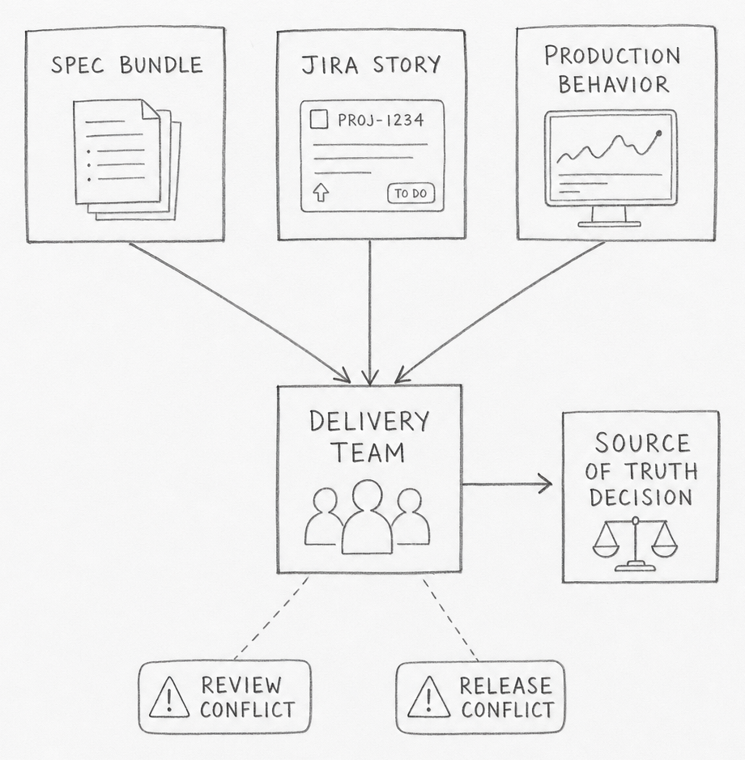
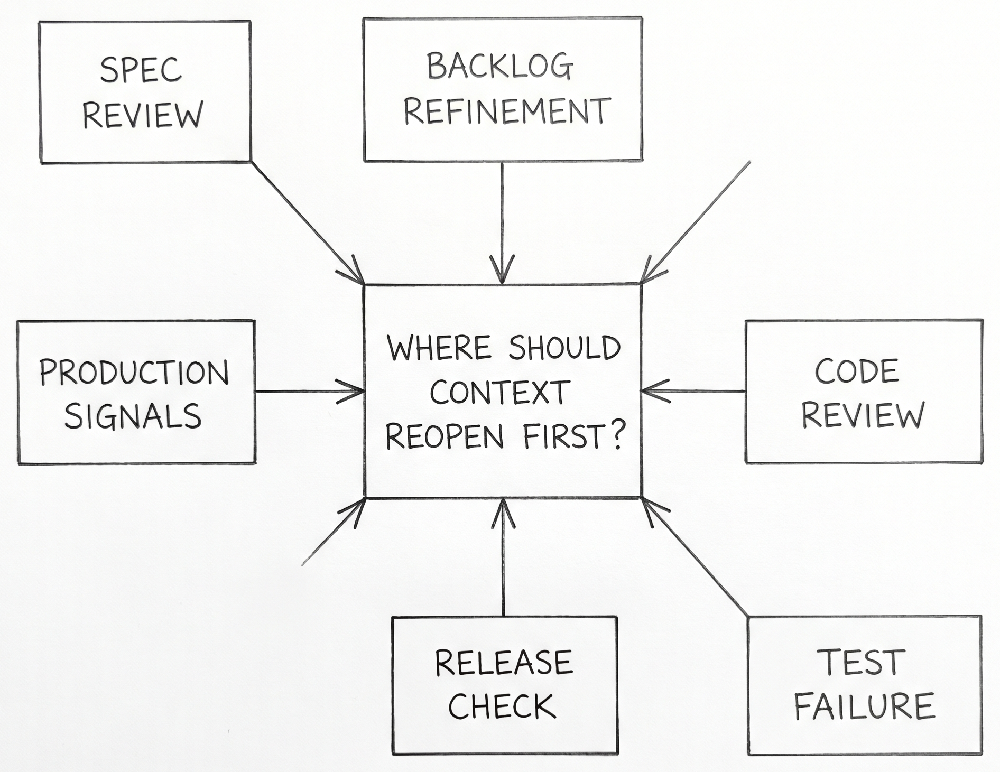
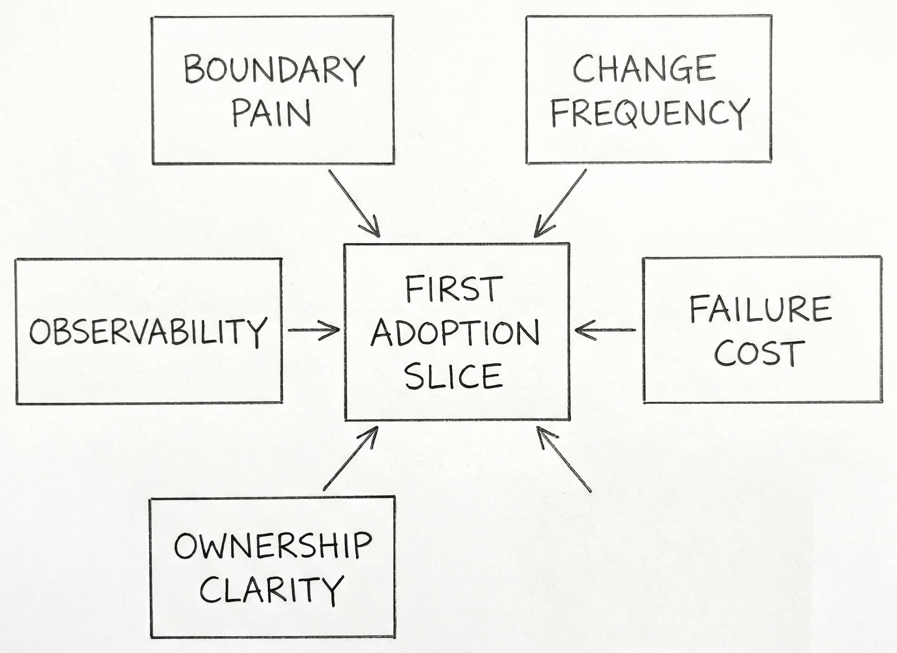

# Managing Spec-Driven Context in a Real Agile SDLC

The spec says one thing. The Jira story says another. Production is still doing a third.

Spec-driven development formalizes requirements, plans, and execution artifacts to reduce ambiguity in software delivery. In an existing Agile product, the first job is not writing more context. It is deciding which context is allowed to be true.

SpecKit is a useful concrete example because it makes the artifact chain visible. You can watch the workflow create files, plans, tasks, and workflow state in the open. The deeper question starts after that: how that context should fit a backlog, a release train, an on-call rotation, and a codebase that already has history. This post uses SpecKit as the example, but the operating model is broader. The goal is to answer what SDD context actually is, where it should live, how it should move through greenfield and brownfield work, and how Agile systems should connect to it without creating duplicate truth.

SDD looks clean in a demo because the demo usually starts with an empty repo, a single feature, and a single person driving the loop. Existing SDLCs do not look like that. A real product already has a backlog, release rules, review queues, hidden dependencies, and production behavior that may disagree with old documents. The moment SDD enters that environment, it stops being a spec-writing problem and becomes a source-of-truth problem.

That is why many first adoptions feel strange. The tooling can generate a specification, a plan, and a task breakdown in minutes. The team still has to decide whether that new context outranks code, runbooks, Jira history, postmortems, API schemas, and live runtime evidence. If that decision stays fuzzy, the output becomes a second documentation system instead of a working delivery system.

The practical tension is simple. Greenfield SDD asks, "What should we build?" Brownfield SDD asks, "Which existing truth are we allowed to change, and what evidence proves the new truth is better?" Those are different jobs. Teams that treat them as the same job usually discover the mismatch in review, in release, or on call.

Three adoption questions appear immediately.

1. What exactly counts as SDD context?
2. Which part of that context should be authoritative, and where?
3. How should Agile workflow tools point to that context without copying it?

Everything else in the post is an answer to those three questions.

---

The first mistake is to treat SDD context as a single spec file. SpecKit makes the real shape easier to see because it creates a full context bundle: bootstrap rules, feature specs, design documents, contracts, validation cues, tasks, and workflow state [1][2][3]. The point is not that SpecKit is special. The point is that SDD only works when the context graph is explicit enough for both humans and agents to navigate.

The cleanest way to think about it is in three layers.

| Layer | Typical artifacts | Job |
|---|---|---|
| **Bootstrap context** | constitutions, integration config, command files | define how the repo expects work to happen |
| **Feature context** | spec, plan, design notes, data model, contracts, tasks | define what this change means and how it should be implemented |
| **Workflow context** | active feature pointer, issue links, run state, approvals | define where the change is in the delivery system |

This matters because each layer ages differently. Bootstrap context changes slowly. Feature context changes whenever scope or behavior changes. Workflow context can change every day. If they all live in one place, the fastest-moving layer drags the others into noise. If they live in disconnected places with no stable identifiers, nobody can tell which document belongs to which change.

That is why "just put the spec in the repo" is only a partial answer. A repo can store the files, but it cannot by itself explain which backlog item approved the work, which deployment carried it, or which incident later contradicted it. SDD context needs file storage, but it also needs a linking model.

The more useful distinction is this: some context explains **intent**, some explains **implementation**, and some explains **evidence**. Intent says what the team is trying to change. Implementation says how the system now expresses that intent. Evidence says whether the change actually behaved as expected after it shipped. If a team cannot separate those three, every discussion about SDD degrades into a debate about tools instead of truth.

SpecKit is strong on the implementation-facing bundle. That is its concrete value. The missing piece in most adoptions is deciding how that bundle should connect to business intent on one side and production evidence on the other.

---

Greenfield is the easiest place to understand what SDD actually generates because the workflow starts before competing artifacts already exist. SpecKit is useful here because each step produces a visible output instead of hiding the process in one long prompt [1][2][3].

| Step | Generated output | What it means in SDLC terms |
|---|---|---|
| `init` | workspace rules and integration config | this repo now has an explicit operating system for delivery |
| `constitution` | project-level principles | the team has codified design and workflow constraints |
| `specify` | `spec.md` and requirements checklist | a new feature now has a written intent and acceptance boundary |
| `clarify` | revised spec | unresolved ambiguity is pushed forward into a durable artifact |
| `plan` | plan, design notes, data model, contracts, quickstart | the work now has implementation-facing structure |
| `tasks` | task breakdown | the feature is decomposed into executable work packages |
| `implement` | code plus task completion state | the change moves from plan to repo reality |

That sequence explains why greenfield SDD feels natural. The repo, the delivery workflow, and the generated context all grow together. There is little ambiguity about whether the spec bundle is ahead of the code or behind it because the bundle is being created at the same time as the feature itself.

Greenfield also explains why teams become overconfident. The clean forward chain can create the impression that the same workflow should drop directly into an older codebase. It rarely does. The old codebase already has its own living artifacts: Jira history, production repositories, runbooks, dashboards, release notes, infrastructure definitions, and user-facing behavior. That is where the next sections become harder.

---

Once a team accepts that context has layers, the next question is where each layer should live. The most useful answer is not "put everything in one platform." It is "separate authority by plane."

| Plane | Best authority | Should not own |
|---|---|---|
| **Agile work system** | business intent, owner, priority, workflow hierarchy | detailed implementation rules |
| **Repo** | implementation-bound spec bundle, contracts, tests, ADRs, trace links | portfolio prioritization, runtime fact |
| **Catalog/docs** | authored narrative, discovery, onboarding, service map | deployment truth or merge gating by default |
| **CI/runtime** | what shipped, where it runs, how it behaves | feature intent |
| **Search/vector/MCP views** | retrieval convenience | anything authoritative |

This model uses four connected truth planes and a fifth derived retrieval layer. The repo is the strongest home for implementation-bound context because it supports review, versioning, co-change, and direct linkage to code. The Agile work system is the strongest home for business commitment because it already manages epics, stories, subtasks, ownership, ordering, and workflow state. Runtime systems are the strongest home for production truth because they can tell you what actually shipped and how it behaved. Catalogs and docs sit in the middle: sometimes they are authored narrative, sometimes they are rendered or ingested views of repo truth. That is why the docs/catalog plane is mixed-authority rather than cleanly authoritative.

This separation is not just neat architecture. It prevents a common failure mode: three copies of the same fact drifting at different speeds. A product requirement should not live fully in Jira, in a spec file, and in a Confluence page with equal authority. One system should own the fact. The others should link to it, summarize it narrowly, or derive from it.

The minimum agent-ready package is smaller than many teams assume:

1. a stable work-item ID
2. a repo-local spec and implementation bundle
3. a small trace manifest linking requirement, code, contracts, tests, and runtime identifiers
4. a runtime identity stamp such as deployment labels or `service.version`
5. optionally, a repo-backed catalog descriptor for cross-service discovery

That is enough for an agent to understand what it is changing, how the team wants it changed, and what evidence should confirm the change after release. Beyond that, every extra artifact needs a reason to exist.

A short analogy helps here. A spec is the flight plan. Production is the weather. Neither one cancels the other.

---

Brownfield adoption is hard to understand when it is described only as a documentation lifecycle. Existing SDLCs already have familiar nouns: production code repositories, engineering environments, deployment pipelines, runbooks, tickets, postmortems, and user-facing systems. Brownfield SDD has to attach itself to those nouns or it stays abstract.

The practical question is not how to document the whole system. It is how one changed slice moves through the systems that already govern delivery. A feature request usually begins as product intent in a ticket or document. Implementation lands in a repo and a CI system. Verification happens in engineering and staging environments. Real contradiction shows up in production behavior, support tickets, or on-call events. Brownfield SDD has to connect those existing surfaces instead of pretending they can be replaced by one generated bundle.

That is why a brownfield spec should start life as a **proposal attached to evidence**, not as authority. The code repo says what the system currently implements. The production environment says how it currently behaves. The Jira record says why the team is changing it now. The documentation layer says what the team believes is true. Brownfield work becomes understandable when those systems are treated as evidence sources around one slice instead of rival masters for the entire estate.

This also makes the governance rule easier to connect to ordinary SDLC language. A brownfield slice becomes trustworthy only after review plus corroboration from at least one implementation source and one runtime or operational source. In plain terms: repo plus tests is not enough on its own, and neither is a product document or a postmortem note on its own.

Teams often hear "start small" here and interpret it as "pick one service." The sharper principle is different. Start where there is a clear seam, a known owner, and enough observable behavior to prove whether the new context actually helped. That might be one API boundary, one workflow, one auth path, or one integration point. The size matters less than the evidence surface.

Brownfield SDD is hard because every familiar SDLC system already contains part of the truth. The job is not to replace them. The job is to decide how a new spec bundle should move among them without becoming one more stale layer.

---

Drift control is not mainly a document-hygiene problem. It is the problem of noticing when the SDD output no longer matches the product or service that is actually running.

Once a service is in production, ground truth is distributed across more surfaces than the spec bundle. The deployed code, live configuration, infrastructure state, feature flags, schema versions, dashboards, alerts, runbooks, support tickets, and user-visible behavior all say something about what the system now is. An SDD artifact can be internally consistent and still be wrong about that running reality.

The hard part is capture. If the team cannot attach the same change identity to the requirement, the spec bundle, the code change, the deployment, the runtime version, and the later incident or support signal, misalignment stays anecdotal. People can say "production is different" without being able to show which truth diverged first, when it diverged, or whether the spec ever matched reality at all.

That is why the most useful capture points are small and durable: stable work-item IDs, release identifiers, deployment labels, `service.version`, contract versions, feature-flag keys, environment markers, dashboard links, and incident references. None of those replaces the spec. They make the spec falsifiable against the running system.

The direction matters. Drift control should not ask only whether the spec still matches `main`. It should ask whether the SDD output can still explain the service that customers, operators, and downstream systems are actually experiencing.

---

The cleanest Agile fit is conservative. Do not ask Jira to become the spec store. Ask Jira to become the commitment and flow layer around the spec store.

| SDD concept | Agile object | What belongs there |
|---|---|---|
| approved feature-level scope | Epic | summary, owner, status, canonical spec link |
| bounded work package | Story / task | short execution scope and acceptance criteria |
| optional execution breakdown | Sub-task | only when it reduces ambiguity |
| contradiction from production | Bug / incident / drift-review item | evidence of mismatch and required correction link |

This model solves a common adoption problem. Teams usually know how to write tickets. They do not know how much SDD detail to paste into them. The answer is: much less than they think. A work item needs enough context to route ownership, communicate scope, and check acceptance. It does not need to carry the entire design history of the change.

That is why the minimal Agile context contract is so small:

- `spec-link`
- `spec-version`
- `work-package-id`
- `review-gate`
- `production-signal` when relevant

Those fields let the ticket point to truth instead of trying to contain truth. The minute a team starts copying whole spec sections into stories, history splits. One version gets refined in the ticket, another in the implementation bundle, a third in review comments. Agile stays fast only when the duplication stays narrow.

Human-in-the-loop checkpoints belong at transitions, not in the middle of every agent step. That pattern fits Agile because Agile is already a system of transitions: ready, in progress, review, release, done. SDD adds stronger context around those transitions. It does not need to replace them.

---

A spec-driven workflow only stays alive if the organization can answer one unpleasant question quickly: what event forces us to reopen context work?

The easiest mistake here is to think of feedback as something that starts only after deployment. That is one feedback source, but it is usually the most expensive one. By the time production proves the context wrong, the team has already paid for the misunderstanding in code, review time, release work, and sometimes user harm.

The more useful question is where a team wants the loop to start for each class of mistake.

| Possible feedback start | What it catches early |
|---|---|
| **Spec review** | missing scope, vague acceptance, hidden stakeholder disagreement |
| **Backlog refinement** | oversized work packages, dependency confusion, ownership gaps |
| **Code review** | design mismatch, missing invariants, implementation drift |
| **Test or CI failure** | contract mismatch, assumption failure, missing operational checks |
| **Release check** | deployment wiring, config drift, rollout risk |
| **Production signals** | live behavior contradictions, reliability problems, unmodeled edge cases |

Different organizations will answer that differently. A platform team may want contract failures and rollout checks to carry more weight than sprint metrics. A product team with rapid UX churn may want the loop to start in backlog refinement and design review. A reliability-sensitive service may define the first serious feedback point at release readiness or error-budget burn. The point is not to pick one universal trigger. The point is to decide which signals are early enough to be useful and strong enough to override momentum.

That is the angle worth holding onto: if the only moment when context can be questioned is after production damage, the loop started too late.

---

The practical adoption path is narrower than the theory. Most teams do not need a full SDD rollout. They need one governed slice where context, flow, and runtime truth start agreeing more often than they used to.

The temptation here is to turn "start small" into a checklist. That misses the harder question: what makes one first slice better than another?

Several angles matter more than step order.

- **Boundary pain**: where are handoffs repeatedly expensive or ambiguous?
- **Change frequency**: where does the team already revisit the same logic often enough to benefit from stronger context?
- **Failure cost**: where does misunderstanding produce real delivery or reliability damage?
- **Ownership clarity**: where can one team actually govern the slice without waiting on half the organization?
- **Observability**: where can the team tell whether the new context improved anything?

**If you lead platform or architecture work**, start where the boundary contract is already painful. API surfaces, auth flows, data contracts, and deployment orchestration create the clearest payoff because mismatch is visible fast.

**If you lead a product team inside an existing Agile cadence**, look for a slice where churn, ambiguity, and review overhead are already obvious. That gives the team a fair test of whether stronger context reduces confusion or just adds process.

**If you run agent-heavy delivery**, favor slices where stale context is easy to detect. Agents follow explicit instructions well. That helps only when the surrounding truth boundaries are legible.

The strongest principle is not "roll out everywhere" or even "start with the easiest case." It is "start where the truth boundary is painful enough that better context would be visible if it worked."

---

The pattern is broader than SpecKit or Agile boards. Every software team needs a way to connect intent, implementation, and evidence without letting each system rewrite the others in secret. Spec-driven development does not solve that by creating more documents — it solves it when the right documents, links, and runtime checks are allowed to govern the same change story. SDD context does not replace SDLC truth — it gives that truth a shape that agents and humans can both work with.

---

**References**

1. GitHub. "Spec Kit Quickstart." [github.com/github/spec-kit](https://github.com/github/spec-kit/blob/main/docs/quickstart.md).
2. GitHub. "Spec Driven Development." [github.com/github/spec-kit](https://github.com/github/spec-kit/blob/main/spec-driven.md).
3. GitHub. "Spec Kit Workflows Reference." [github.com/github/spec-kit](https://github.com/github/spec-kit/blob/main/docs/reference/workflows.md).
4. Microsoft. "Strangler Fig Pattern." [learn.microsoft.com](https://learn.microsoft.com/en-us/azure/architecture/patterns/strangler-fig).
5. AWS. "Strangler Fig Modernization Pattern." [docs.aws.amazon.com](https://docs.aws.amazon.com/prescriptive-guidance/latest/cloud-design-patterns/strangler-fig.html).
6. Microsoft. "Architecture Decision Records." [learn.microsoft.com](https://learn.microsoft.com/en-us/azure/well-architected/architect-role/architecture-decision-record).
7. Atlassian. "Jira and Confluence Integration." [atlassian.com](https://www.atlassian.com/software/confluence/jira-integration).
8. Microsoft. "End-to-End Traceability with Azure DevOps." [learn.microsoft.com](https://learn.microsoft.com/en-us/azure/devops/cross-service/end-to-end-traceability?view=azure-devops).
9. Google. "Postmortem Culture." [sre.google](https://sre.google/sre-book/postmortem-culture/).
10. Google. "Error Budget Policy." [sre.google](https://sre.google/workbook/error-budget-policy/).
11. OpenAPI Initiative. "OpenAPI Best Practices." [learn.openapis.org](https://learn.openapis.org/best-practices.html).
12. Backstage. "Descriptor Format." [backstage.io](https://backstage.io/docs/features/software-catalog/descriptor-format/).
13. OpenTelemetry. "Service Semantic Conventions." [opentelemetry.io](https://opentelemetry.io/docs/specs/semconv/resource/service/).
14. Microsoft. "Azure DevOps Branch Policies." [learn.microsoft.com](https://learn.microsoft.com/en-us/azure/devops/repos/git/branch-policies?view=azure-devops).
15. Professional Kanban. "The Kanban Guide." [prokanban.org](https://prokanban.org/the-kanban-guide/).
16. DORA. "DORA Metrics and Documentation Quality." [dora.dev](https://dora.dev/guides/dora-metrics-four-keys/).
