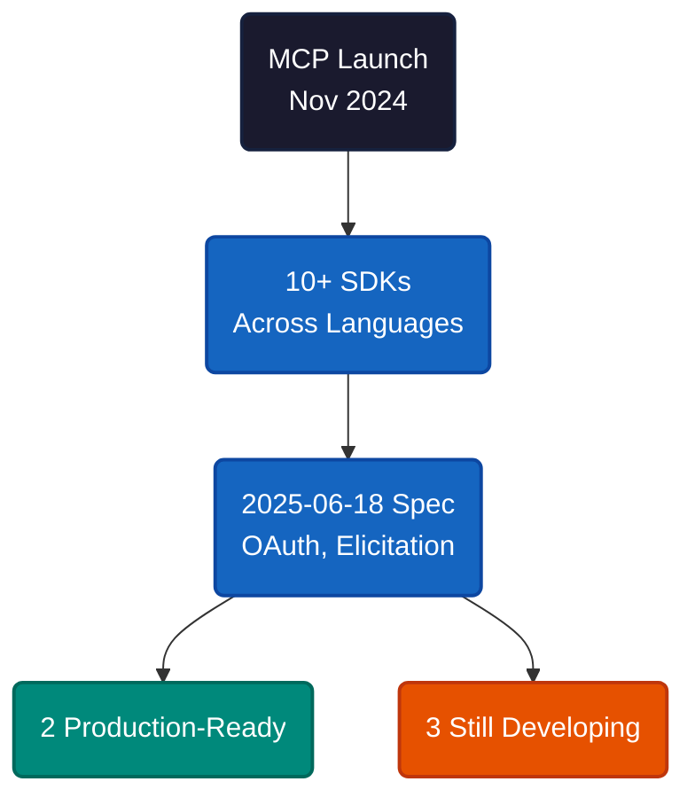
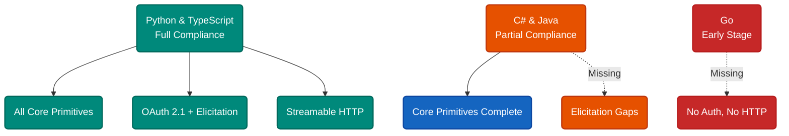
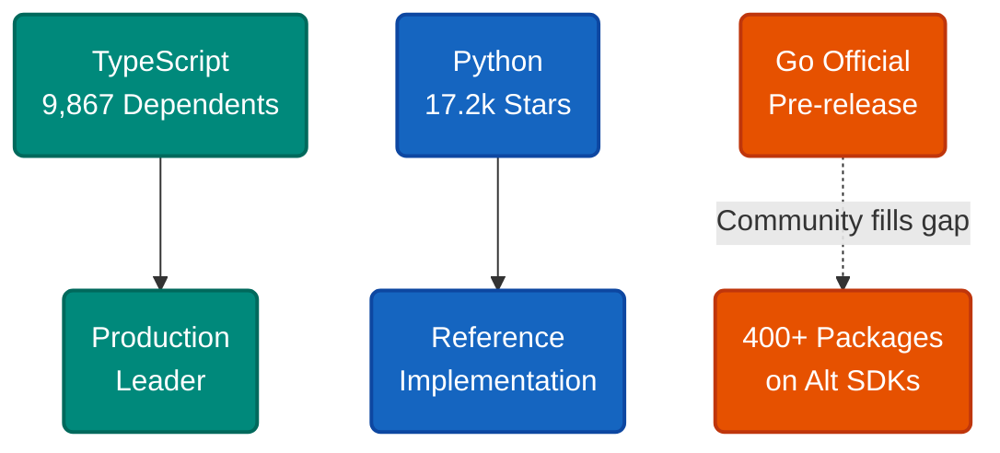

# Picking an MCP SDK When Half of Them Aren't Ready

You want to build an MCP server. You pick a language, find the SDK, start wiring up tools — and three hours later discover the SDK doesn't support authentication, the API is marked unstable, and the last release was a preview. The protocol has ten SDKs. Two are production-grade. The rest are somewhere between "almost" and "not yet."

Here's where each one actually stands as of August 2025.

MCP launched in November 2024. Nine months later, the ecosystem has 10+ SDK implementations across every major language, backed by Anthropic, Microsoft, Google, JetBrains, and Spring AI. The current specification is **2025-06-18**, and it added OAuth 2.1, elicitation, and structured output — features that separate the mature SDKs from the rest.

The gap between "has an SDK" and "the SDK is ready" is the entire problem. Language support exists. Feature parity does not.

---

Not all SDKs are equal. Compliance with the 2025-06-18 specification breaks them into three tiers.

| SDK | Version | Spec Compliance | Tier |
|---|---|---|---|
| **Python** | 1.17.0+ | 95% | Production |
| **TypeScript** | 1.17.1 | 90% | Production |
| **C#** | 0.3.0-preview | 85% | Enterprise Preview |
| **Java** | In development | 75% | Enterprise Preview |
| **Go** | Pre-release | 60% | Development |

Python and TypeScript implement everything: tools, resources, prompts, roots, sampling, OAuth 2.1, elicitation, streamable HTTP. The C# SDK covers the same ground but ships as a preview — Microsoft is behind it, and the .NET integration is solid, but breaking changes are still possible. Java has Spring Boot patterns locked in but gaps in elicitation. Go is explicitly unstable, missing authentication entirely.

The feature that draws the sharpest line is **OAuth 2.1**. Any production deployment behind authentication needs it. Python, TypeScript, C#, and Java have it. Go does not.

---

Stars and downloads tell a different story than compliance scores. Python has the most GitHub stars (17,200) but TypeScript has the deepest dependency graph — 9,867 NPM packages depend on it. That means more production code runs on the TypeScript SDK than any other.

| SDK | GitHub Stars | Package Dependents | Signal |
|---|---|---|---|
| TypeScript | 9.1k | 9,867 NPM packages | Widest production use |
| Python | 17.2k | High PyPI volume | Reference implementation |
| C# | 3k | 163k NuGet downloads | Enterprise adoption |
| Go | 1.4k | 400+ (community SDKs) | Community outpaces official |

The Go row is worth noting. The official SDK is pre-release, but community alternatives like `mcp-golang` and `mcp-go` already have hundreds of dependent packages. Developers aren't waiting for the official version — they're building anyway.

---

**If you're starting a new MCP server**, use Python or TypeScript. Both are 1.x, both cover the full spec, both have large communities finding bugs before you do. Python's FastMCP framework is particularly good for rapid prototyping.

**If you're in a .NET or Java shop**, the C# and Java SDKs are viable for internal tooling. Pin your versions. Expect some churn in the API surface.

**If you need Go**, evaluate the community SDKs (`mcp-golang`, `mcp-go`) over the official one. The official SDK targets a stable release in August 2025, but the community versions already have production mileage.

**If you're evaluating Kotlin or Swift**, wait. Both are in early development. Kotlin is interesting for its multiplatform ambitions (JVM, WebAssembly, iOS), but neither is ready for production work.

---

The pattern here is not about languages — it is about institutional momentum. The SDKs with corporate backing and large contributor bases converge on the spec fastest. The rest get there eventually, but "eventually" matters when you're choosing a foundation. Picking an SDK is not picking a language — it is picking a maintenance trajectory.

---

**References**

1. Model Context Protocol. "MCP Specification (2025-06-18)." [spec.modelcontextprotocol.io](https://spec.modelcontextprotocol.io/).
2. Anthropic. "Model Context Protocol Documentation." [modelcontextprotocol.io](https://modelcontextprotocol.io/).
3. GitHub. "modelcontextprotocol/python-sdk." [github.com/modelcontextprotocol/python-sdk](https://github.com/modelcontextprotocol/python-sdk).
4. GitHub. "modelcontextprotocol/typescript-sdk." [github.com/modelcontextprotocol/typescript-sdk](https://github.com/modelcontextprotocol/typescript-sdk).
5. GitHub. "modelcontextprotocol/csharp-sdk." [github.com/modelcontextprotocol/csharp-sdk](https://github.com/modelcontextprotocol/csharp-sdk).
