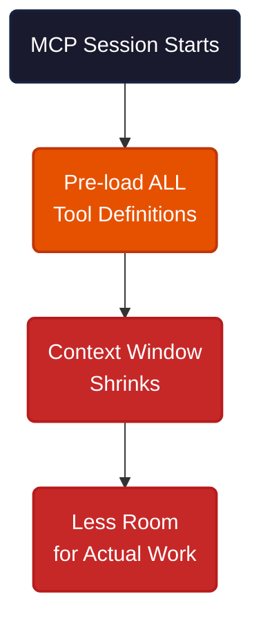
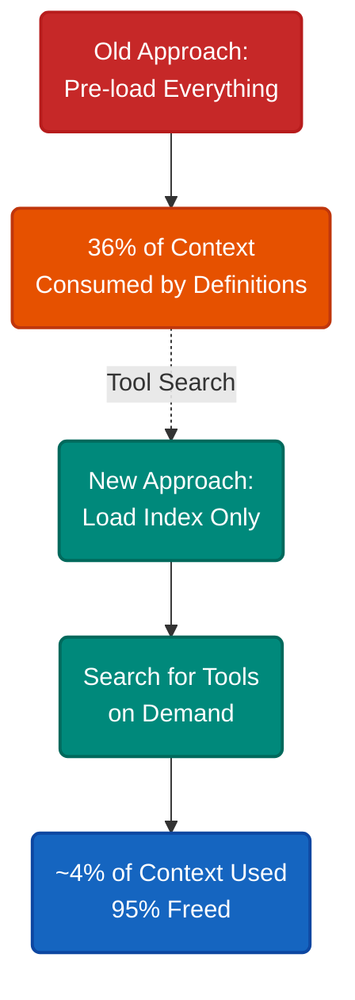
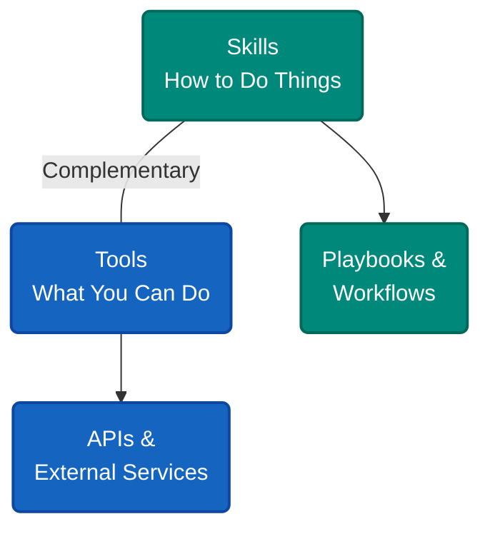
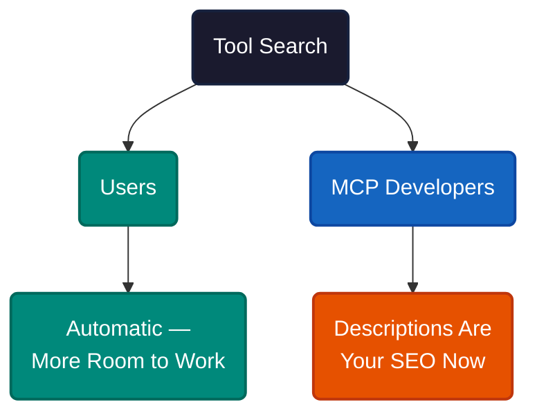

# When Your AI's Plugin System Eats Its Own Brain

Five MCP (Model Context Protocol) servers configured. Context window already one-third gone before you type anything. The more tools you add, the less room your AI has to actually work.

This is the biggest pain point in MCP today. And it finally has a fix.

MCP requires all tool definitions to be pre-loaded into the context window at session start. Tool names, parameter details, descriptions — everything gets packed in so the AI knows what's available.

Each tool costs hundreds of tokens (the units that measure how much text fits in the AI's working memory). A single MCP server might expose 10-30 tools. Stack a few servers and you're burning tens of thousands of tokens on definitions the AI may never use in that session.

This is a design shortcut baked into the protocol. MCP was built when 5-10 tools was normal. Pre-loading worked fine. But the tool count grew fast. Users now run 50+ tools across multiple servers, and the "load everything" approach breaks down. One GitHub issue reported 54% of context consumed before the first prompt.

The community put it well: MCP makes AI more capable while shrinking its brain.

---

Claude Code introduced a feature called **Tool Search** — the first MCP client to tackle this problem. Instead of dumping every tool definition into context at startup, it loads a compact index and discovers tools on demand.

It kicks in automatically when MCP tool definitions exceed 10% of the context window. Below that threshold, everything loads normally — no change for lightweight setups.

Here's the flow: startup loads only tool names and brief hints. When you give a task, the AI searches the index for relevant tools. Only matched tools get their full definitions loaded. The AI can search multiple times, try different keywords, and refine results.

In Claude Code, you configure this with the `ENABLE_TOOL_SEARCH` environment variable:

| Value | Behavior |
|---|---|
| `auto` | Activates at 10% of context (default) |
| `auto:5` | Custom threshold — here, 5% |
| `true` | Always on |
| `false` | Disabled |

The result: a setup that previously consumed 36% of context for tool definitions now uses about 4%. Over 95% of the window freed for actual work.

---

Since Tool Search implements lazy loading, you might ask: don't skills already do this?

Yes — but they solve different problems. **Skills** are playbooks. They're markdown files that teach your AI *how* to approach tasks. A skill might describe how to generate a GIF that meets Slack's size limits, or how to run a deployment pipeline. Skills don't give the AI new abilities — they make it smarter with what it already has.

**Tools** (via MCP) are capabilities. They give the AI entirely new powers: calling external APIs, querying databases, operating third-party services. Without the MCP server, these actions aren't possible.

Skills are the instruction manual. Tools are the equipment.

The interesting part: skills can wrap tools. Many developers cut context usage by wrapping MCP functionality in a skill. With Tool Search, this workaround matters less — but both remain complementary.

This pattern applies broadly. Cursor separates rules from tools. VS Code has task runners and extensions. Any system that separates "how to do things" from "what you can do" uses this same distinction.

---

**If you use Claude Code**, there's nothing to do. Tool Search activates automatically. You'll just notice more context available — longer conversations, more complex tasks, fewer interruptions. No other MCP client — Cursor, Windsurf, Cline, VS Code Copilot — has an equivalent feature yet.

**If you build MCP servers**, one thing changes in Claude Code: your `server instructions` field matters now. In search mode, the AI needs to know *when* to look for your tools. Clear instructions — "this server handles database queries" or "use this for CI/CD operations" — help the AI find your tools at the right moment. Vague or missing instructions mean your tools get buried.

Think of it like SEO. Before, tools sat on the shelf in plain view. Now they need to be discoverable.

---

The pattern is universal: load the catalog up front, load the full details on demand. Claude Code is the first client to ship it, but every MCP client faces the same ceiling. As tool counts grow, the bottleneck shifts from the AI model to the infrastructure around it. Tool Search doesn't make the AI smarter — it removes a ceiling that was making it artificially dumber.

---

**References**

1. Anthropic. "Scale with MCP Tool Search." [Claude Code Documentation](https://code.claude.com/docs/en/mcp#scale-with-mcp-tool-search).
2. GitHub Issue #7336. "Lazy Loading for MCP Servers and Tools." [github.com/anthropics/claude-code/issues/7336](https://github.com/anthropics/claude-code/issues/7336).
3. Thariq. Announcement on X. [x.com/thariq212/status/2011523109871108570](https://x.com/thariq212/status/2011523109871108570).
