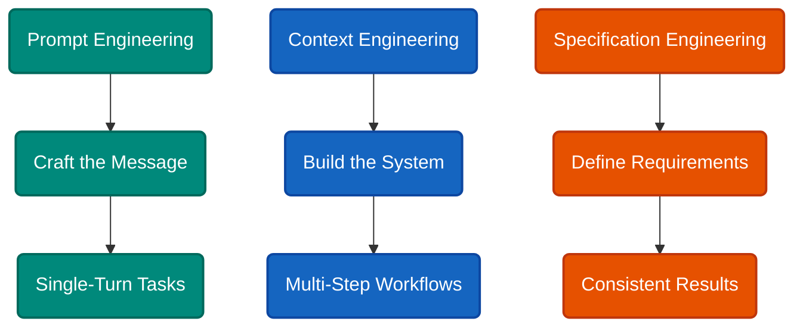
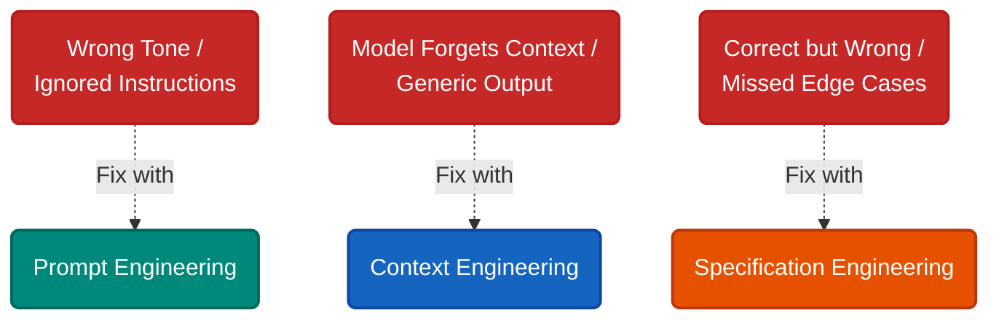
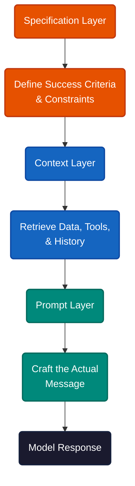
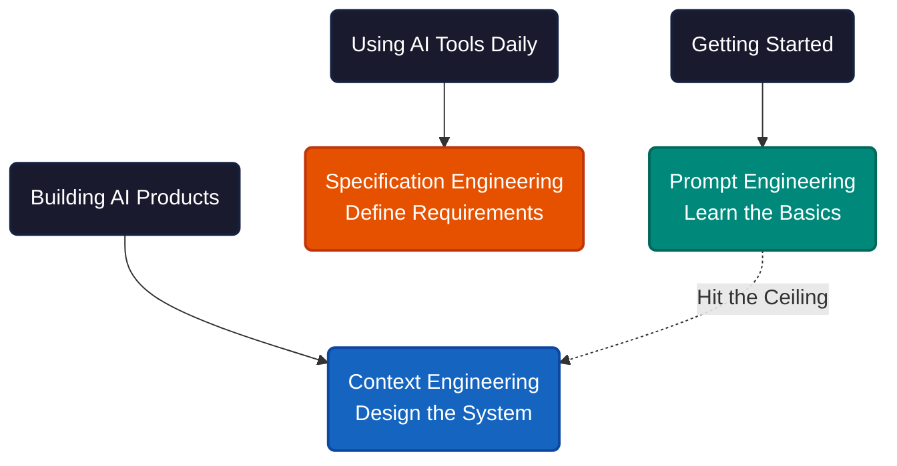

# Three Ways to Talk to an AI (and Why You Keep Picking the Wrong One)

You ask the model to refactor a function. It ignores half your constraints. You add more detail to the prompt, reword it three times, sprinkle in "think step by step." Still wrong. The problem was never your wording. The problem was that the model didn't have what it needed to succeed — and no amount of prompt tweaking would fix that.

Three engineering disciplines have emerged around this gap. They look similar from the outside, but they solve fundamentally different problems.

**Prompt engineering** is what most people start with: crafting the text string you send to a model. Zero-shot, few-shot, chain-of-thought, role assignment. It works well for simple, self-contained tasks — a single question, a quick transformation, a format conversion. The entire problem fits inside one message.

**Context engineering** is what you graduate to when prompts stop working. It's the system around the prompt: what data gets retrieved, which tools are available, how conversation history is managed, what gets injected into the context window before the model ever sees your request. Context engineering treats the AI interaction as an architecture problem, not a copywriting problem.

**Specification engineering** is the newest layer. Instead of optimizing how you ask or what surrounds the ask, you focus on defining exactly what you want — success criteria, edge cases, constraints, output format. It comes from the recognition that as models get smarter, the bottleneck shifts from clever prompting to clear requirements. OpenAI's Model Spec formalized this idea.

---

The failure modes tell you which discipline you actually need.

Bad prompt engineering looks like wrong tone, ignored instructions, inconsistent formatting. You're saying the right thing in the wrong way. The fix is technique: better structure, examples, explicit constraints within the message itself.

Bad context engineering looks like the model forgetting why it's in the conversation. Outputs go generic or unhinged. RAG retrieval breaks. Tool chaining fails. The model had the right instructions but the wrong information — or too much of it. The fix is architectural: what fills the context window and why.

Bad specification engineering looks like outputs that are technically correct but miss the point. The model did what you asked, just not what you meant. Edge cases slip through. Results vary between runs. The fix is requirements: defining what "done" looks like before you start.

---

These aren't competing approaches. They're layers.

Specification engineering sits on top: you define what you want and how to measure success. Context engineering sits in the middle: you build the system that feeds the model the right information, tools, and history. Prompt engineering sits at the bottom: you craft the actual message the model receives.

A coding assistant illustrates the stack. The specification says "refactor this code to follow team conventions, preserve comments, maintain test coverage." The context system retrieves the style guide, pulls in the test suite, loads relevant files. The prompt structures the actual request with examples and format instructions.

---

**If you're a developer** building production AI features, context engineering is where most of your time should go. The system around the model matters more than the words inside the prompt. Retrieval pipelines, tool selection, memory management — these determine whether your AI works reliably or just demos well.

**If you're a power user** of AI coding tools — Claude Code, Cursor, Copilot — specification engineering pays the highest returns. These tools already handle context for you. Your leverage is in writing clear requirements: CLAUDE.md files, project rules, task definitions that leave no ambiguity about what "done" means.

**If you're just getting started**, prompt engineering is the right entry point. Learn few-shot examples, chain-of-thought reasoning, and explicit formatting instructions. But recognize the ceiling. When your prompts keep failing despite rewrites, the problem has moved up the stack.

---

The pattern is universal across every AI tool, not just one vendor's ecosystem. The discipline is not prompt optimization — it is system design. The question was never "how do I ask better questions." It was "does the model have what it needs to answer."

---

**References**

1. Paulo César. "Prompt Engineering is Dead, Spec Writing is the New Superpower." [Medium](https://medium.com/@paulocsb/prompt-engineering-is-dead-spec-writing-is-the-new-superpower-ee532894121e).
2. OpenAI. "Introducing the Model Spec." [openai.com](https://openai.com/index/introducing-the-model-spec/).
3. Addyo. "Context Engineering: Bringing Engineering Discipline to Prompts." [Substack](https://addyo.substack.com/p/context-engineering-bringing-engineering).
4. Phil Schmid. "The New Skill in AI is Not Prompting, It's Context Engineering." [philschmid.de](https://www.philschmid.de/context-engineering).
