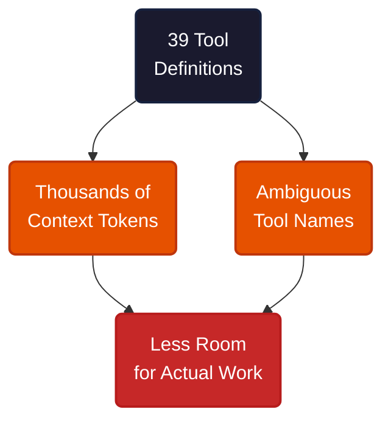
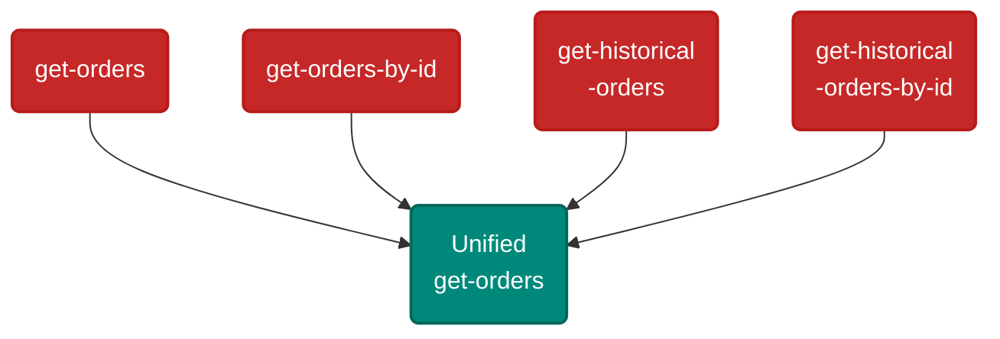
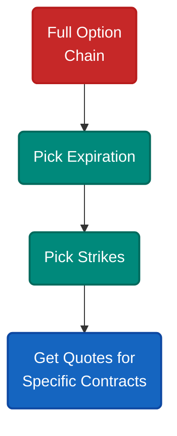
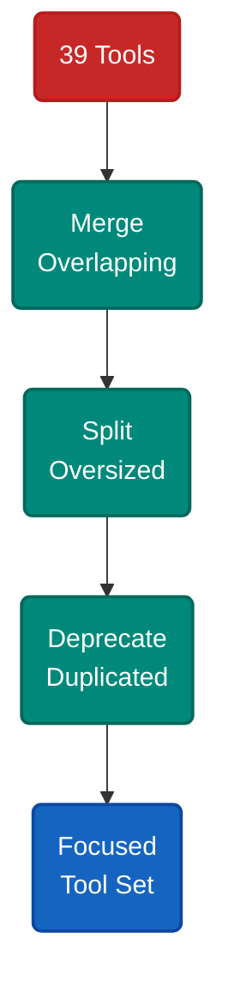

# When 39 Tools Is 30 Too Many

A TradeStation MCP server exposes 39 endpoints. Market data, portfolio management, order execution, option chains, news, fundamentals, symbol lookup. An LLM agent loading all these tool definitions burns thousands of context tokens before doing any actual work.

The problem is not the breadth of functionality. It is that 39 separate tools force the LLM to navigate a menu that no human would tolerate either.

Each tool definition costs hundreds of tokens — name, description, parameters, types. At 39 endpoints, the definitions alone consume 10-20% of the context window. But the bigger cost is cognitive: the LLM must select the right tool from a long, ambiguous list for every action.

Consider the overlap. `get-orders` versus `get-orders-by-id` versus `get-historical-orders` versus `get-historical-orders-by-id` — four endpoints that could be one with optional parameters. `confirm-order` and `confirm-group-order` do the same thing for single-leg and multi-leg trades. `get-balances` and `get-balances-bod` differ only in the time reference. `search-for-symbols` and `suggest-symbols` serve the same purpose with slightly different matching logic.

This redundancy reflects an API built for traditional REST consumers where explicit endpoints are idiomatic. But LLMs navigate tools by description, not by URL pattern. Fewer, smarter tools serve them better.

---

Three patterns signal that tools should be merged.

**Same data, different filters.** `get-orders` and `get-historical-orders` both return orders — one current, one past. A single `get-orders` endpoint with an optional date range and status filter covers both. Fold in the by-ID variants with an optional ID parameter: four endpoints become one.

**Same action, different arity.** `confirm-order` validates a single trade. `confirm-group-order` validates a multi-leg spread. A unified `confirm-order` that accepts either a single order object or an array of legs eliminates the choice. Same for the corresponding place endpoints.

**Same entity, different snapshots.** `get-balances` returns current balances. `get-balances-bod` returns the beginning-of-day snapshot. One endpoint with a `when` parameter — current, BOD, or a specific date — replaces both.

The same logic applies to symbol lookup: `search-for-symbols` and `suggest-symbols` merge into a single `lookup-symbol` that handles exact matches and fuzzy suggestions based on the input.

---

Merging reduces tool count. Splitting reduces response size. Both serve the same goal.

The option chain is the clearest case. `get-option-chain-snapshot` returns every strike across every expiration for a symbol — potentially thousands of contracts in a single response. An LLM rarely needs all of them. The existing split into separate endpoints for expirations, strikes, and quotes makes sense here because each query narrows the data before the next.

The principle: split when the full dataset exceeds what an LLM can usefully process in one response. Keep tools granular when each step meaningfully narrows the next query. The option chain flow — pick expiration, then strikes, then quotes — mirrors how a trader actually thinks. This is the opposite of the merge pattern. Merging reduces ambiguity in tool selection. Splitting reduces volume in tool output.

---

Some tools can be dropped entirely. News and fundamentals data are available through web search and external APIs. If the LLM agent has internet access, dedicated endpoints for these duplicate what it already reaches. Static reference data — available order routes, activation trigger types, crypto symbol lists — changes rarely enough to be embedded in the agent's instructions rather than fetched at runtime.

The remaining tools are the ones only the MCP server can provide: account positions, balances, order execution, real-time quotes. These are the endpoints where the server adds unique value that no external source replaces.

The target is not a specific number. It is the point where every remaining tool is both necessary and unambiguous — where the LLM never hesitates between two tools for the same task, and no single tool returns more data than the model can process.

---

The pattern applies to any API designed for LLM consumption. Merge when tools overlap in purpose. Split when tools overwhelm in output. Deprecate when external sources duplicate the data. Tool count is not a feature — it is a tax on every interaction, and the right API surface is not the one with the most endpoints but the one where every tool earns its context window cost.

---

**References**

1. Anthropic. "Model Context Protocol Specification." [modelcontextprotocol.io](https://modelcontextprotocol.io).
2. TradeStation. "API Documentation." [api.tradestation.com](https://api.tradestation.com/docs/specification).
3. GitHub Issue #7336. "Lazy Loading for MCP Servers and Tools." [github.com/anthropics/claude-code/issues/7336](https://github.com/anthropics/claude-code/issues/7336).
