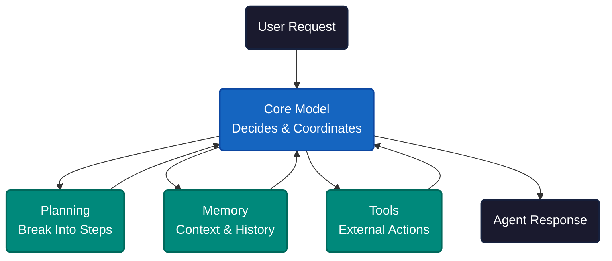
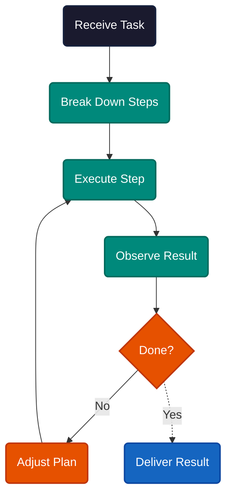
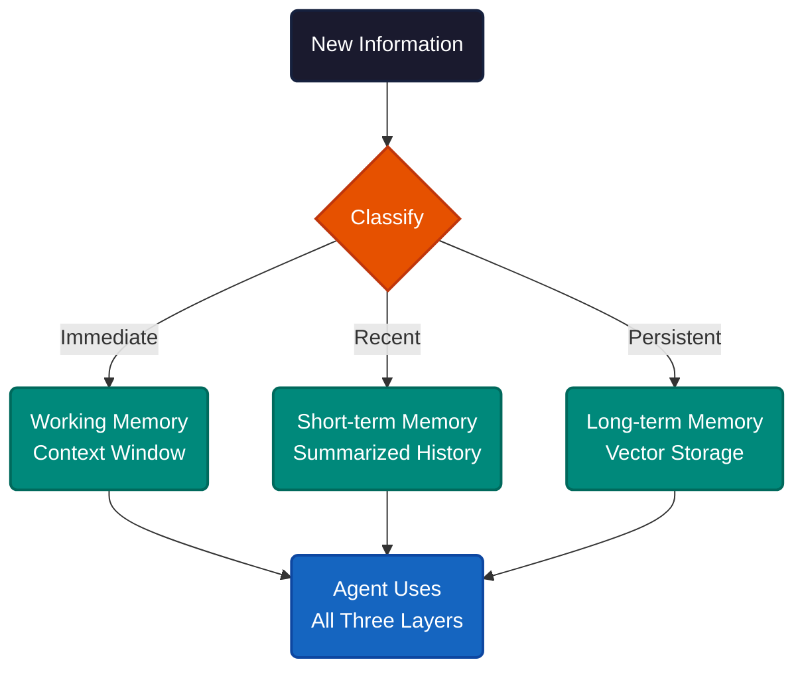
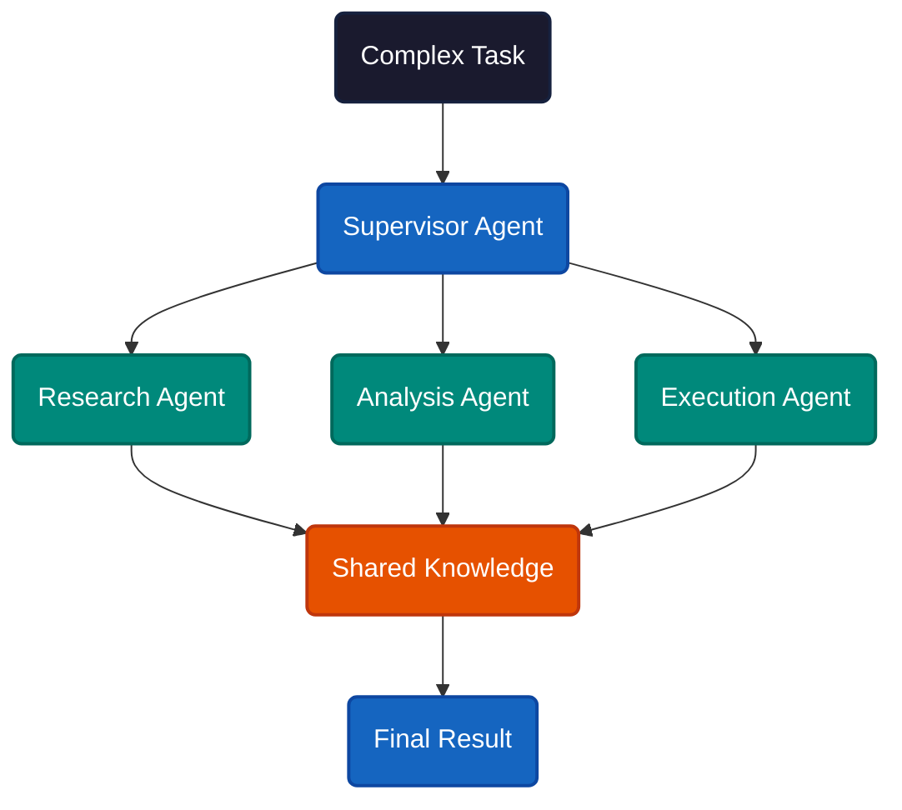

# What Makes an AI Agent an Agent

A chatbot answers questions. An agent does the work. The difference is not intelligence — it is a loop. The system perceives its environment, decides what to do, acts, observes the result, and repeats until the task is done. That loop, not the language model underneath, is what separates agents from everything else in AI.

Every agent has the same four components: a core model, a planning system, memory, and tools. The model is the decision-maker. Planning breaks complex requests into steps. Memory retains context within and across sessions. Tools let the agent reach outside itself — call APIs, query databases, execute code.

What makes this different from a chatbot with plugins is the execution loop. The agent does not fire one tool call and return. It cycles — perceive, act, observe, reflect — adjusting its plan after each step. If a file search returns nothing useful, it tries a different query. If a test fails, it reads the error and patches the code. The loop runs until the task succeeds or the agent determines it cannot.

Planning operates in two modes. Without feedback, the agent maps out every step upfront. With feedback — using approaches like ReAct, which interleaves reasoning with action — the agent replans after each observation. Most production agents use the feedback mode. Upfront plans break the moment reality deviates from expectation.

---

The language model provides a foundation — world knowledge, reasoning patterns, language understanding — but it is frozen at training time. Agents overcome this through three dynamic sources.

**Retrieval-Augmented Generation (RAG)** connects the agent to external knowledge bases and documents in real time. The model generates answers grounded in retrieved facts instead of relying on stale training data.

**Model Context Protocol (MCP)** gives agents new capabilities entirely. MCP servers expose tools — calculations, code execution, API access — through a standardized interface. One server works with any compatible client. It is the closest thing to a universal plug for AI.

**Fine-tuning and RLHF** shape how the model follows instructions and aligns with human preferences. Domain-specific tuning creates agents specialized for healthcare, finance, or legal work without changing the underlying architecture.

Tools are where agents cross the line from reasoning to real-world impact. When an agent decides to act, the request passes through security checks, executes in a sandboxed environment (Docker, WebAssembly, or platforms like E2B), and validates results before applying changes. The sandbox matters. Without it, a hallucinated shell command becomes a production incident.

---

Memory is what turns a stateless model into something that learns. Agents use three layers.

**Working memory** is the context window itself — the active conversation and current task state. Modern windows hold over 150,000 words, but that space fills fast with tool definitions, code, and conversation history.

**Short-term memory** manages recent interactions through techniques like conversation summarization. When the window fills, older exchanges get compressed rather than dropped, preserving essential context.

**Long-term memory** persists across sessions using external storage. Vector databases store past conversations and facts as embeddings, retrievable by meaning rather than keyword. Systems like MemGPT let the agent itself decide what to remember, what to forget, and when to retrieve.

---

One agent hits a ceiling quickly. Multi-agent systems break past it by assigning specialized roles — a supervisor coordinates while dedicated agents handle research, analysis, writing, or review. Each runs in its own context window. They share information through common knowledge bases or MCP servers.

Frameworks like CrewAI use role-playing coordination. LangGraph provides graph-based workflows. Production systems like Devin pair planning agents with execution agents. In healthcare, multi-agent review has shown 11.8% accuracy improvements over single-agent approaches.

**If you're a developer**, this means your coding assistant is already an agent — it reads files, runs tests, edits code, and iterates. The better you structure your project context (documentation, type hints, test suites), the more effective the loop becomes.

**If you're evaluating AI tools**, look for the loop. Can the system retry when something fails? Can it use results from one step to inform the next? If it fires a single request and returns, it is a chatbot with extra steps — not an agent.

**If you're building agents**, reliability compounds. If each step succeeds 90% of the time, a five-step task succeeds only 59% of the time. Hallucination, tool errors, and context limits all degrade trust. Sandboxed execution, human-in-the-loop oversight for critical decisions, and production monitoring (LangSmith, Langfuse) are not optional — they are the difference between a demo and a deployment.

---

The pattern is not about any single model or framework — it is a loop. Perceive, plan, act, observe, adjust. That loop predates LLMs and will outlast them. Agents are not smarter chatbots — they are software systems that happen to use language models as their reasoning engine.

---

**References**

1. Anthropic. "Building effective agents." [anthropic.com/research/building-effective-agents](https://www.anthropic.com/research/building-effective-agents).
2. Lilian Weng. "LLM Powered Autonomous Agents." [lilianweng.github.io](https://lilianweng.github.io/posts/2023-06-23-agent/).
3. Yao, S. et al. "ReAct: Synergizing Reasoning and Acting in Language Models." arXiv:2210.03629 (2022).
4. Anthropic. "Model Context Protocol." [modelcontextprotocol.io](https://modelcontextprotocol.io/).
5. Packer, C. et al. "MemGPT: Towards LLMs as Operating Systems." arXiv:2310.08560 (2023).
